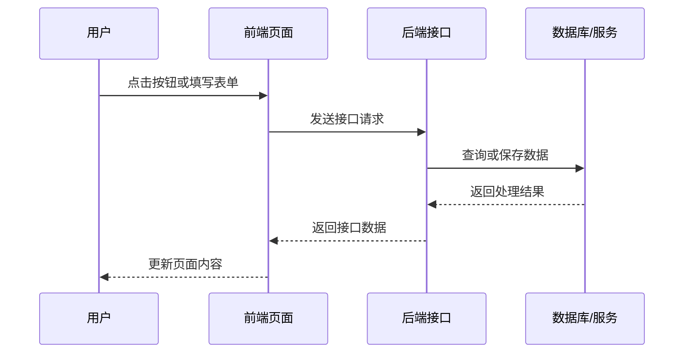
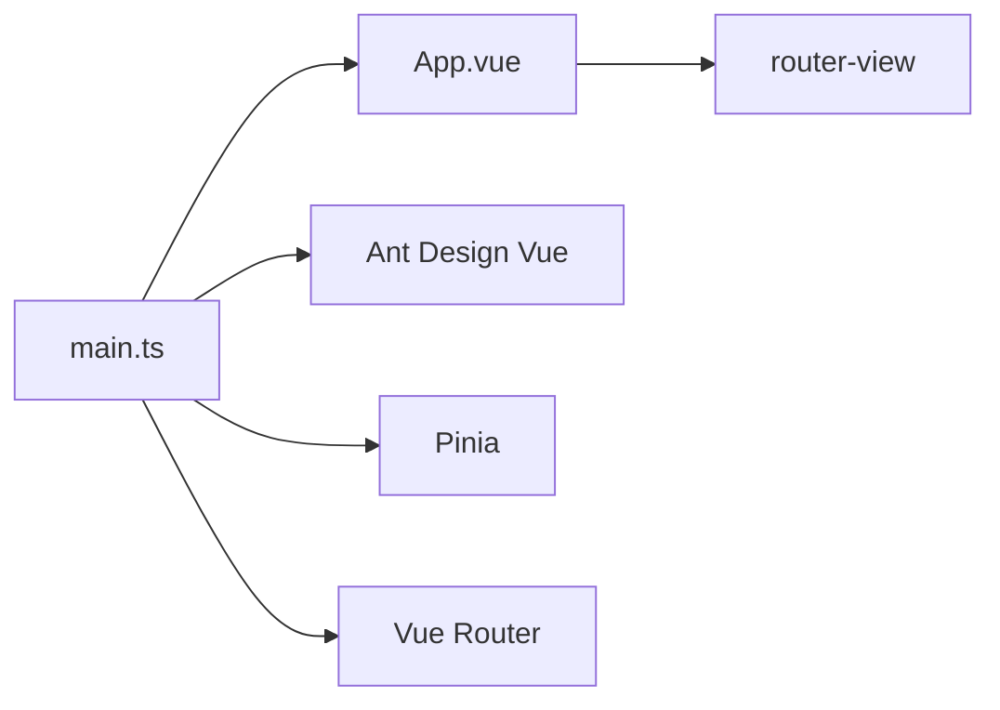

# 前端开发流程介绍

## 目录

| 章节 | 内容 |
| --- | --- |
| 1 | 前端开发负责什么 |
| 2 | 一套前端开发流程 |
| 3 | 项目代码如何组织 |
| 4 | 主要技术说明 |
| 5 | 测试与质量保障 |
| 6 | 规范和 AI 协作 |

---

## 1. 前端开发负责什么

**备注**

- 先讲用户能看到和操作的部分，再引出接口和数据。
- 不需要在这一部分解释 Vue、Vite、Pinia 等技术细节。

**讲稿**

前端开发主要负责浏览器中的页面展示和用户操作。用户点击按钮或填写表单后，前端会向后端接口发送请求，后端处理完成后返回结果，前端再将结果展示到页面上。

因此，前端工作不只是页面样式，还包括接口通信、状态管理、错误处理、测试和发布。本次介绍以 `iframeMode-template` 为例，说明一套前端开发流程和基础工程结构。

**介绍重点**

- 先说明前端在整个系统中的位置。
- 让非前端听众理解：前端负责用户可见、可操作的部分。
- 引出后续的接口、状态、测试和发布。

**引入方式**

可以从“用户打开一个系统后，首先接触到的就是前端页面”开始。先不要讲技术名词，先讲用户看到什么、点击什么、数据如何返回。

前端开发负责用户在浏览器中看到和操作的部分。

它不只是页面样式，还包括：

- 页面结构和交互。
- 数据展示。
- 表单提交。
- 与后端接口通信。
- 登录状态、页面状态管理。
- 错误提示、加载状态、空数据状态。
- 浏览器兼容和构建发布。

一次常见页面操作流程：



本项目使用 `iframeMode-template` 作为说明案例。它是一个 Vue 3 前端模板，当前是模板基座，不包含具体业务页面。

---

## 2. 一套前端开发流程

**备注**

- 重点说明前端开发是一条流程，不是单一编码动作。
- 时间较短时可只讲：需求、设计、接口、开发、联调、发布。

**讲稿**

一套前端开发通常从需求确认开始。前端需要明确页面功能、交互方式和展示数据。随后根据页面设计确认布局、字段和异常状态，并与后端确认接口结构、请求参数和返回字段。

开发阶段主要编写页面、组件、路由、状态和样式。页面完成后进入接口联调，重点处理接口成功、失败、无权限和登录过期等情况。最后通过自测、测试验收和构建发布完成交付。

**介绍重点**

- 说明前端开发不是直接写代码。
- 按顺序介绍需求、设计、接口、开发、联调、测试、发布。
- 说明本项目模板覆盖的是流程中的基础工程能力。

**引入方式**

可以从“一个前端功能从提出到上线，通常会经过多个阶段”开始。先展示流程图，再逐个解释每个阶段前端要做什么。

常见流程如下：


各阶段内容：

| 阶段 | 前端工作 |
| --- | --- |
| 需求确认 | 确认功能、页面、按钮、表单、列表、弹窗 |
| 页面设计 | 确认布局、交互、展示字段、异常状态 |
| 接口约定 | 确认接口结构、请求参数、返回字段 |
| 页面开发 | 编写页面、组件、路由、状态、样式 |
| 接口联调 | 接入后端接口，处理成功、失败、无权限、登录过期 |
| 自测和测试 | 检查显示、交互、异常、边界情况 |
| 构建发布 | 打包成静态文件，交给部署环境 |

---

## 3. 项目代码如何组织

**备注**

- 目录讲解只需要说明职责，不需要展开配置细节。
- 重点强调 `src/` 是业务开发的主要目录。

**讲稿**

前端项目通常按职责拆分目录。根目录主要放项目配置、构建配置、测试配置、代码生成器和文档。真正的前端源码集中在 `src/`。

`components/` 放通用组件，`hooks/` 放复用逻辑，`router/` 管理页面地址，`stores/` 管理多个页面共享的数据，`types/` 放类型定义，`utils/` 放请求和图表等基础工具。

应用启动时，`main.ts` 创建 Vue 应用，并注册 Ant Design Vue、Pinia 和 Router。随后挂载 `App.vue`，由 `router-view` 显示当前页面。

**介绍重点**

- 说明前端项目为什么需要目录分层。
- 说明根目录和 `src/` 的区别。
- 重点介绍 `components`、`hooks`、`router`、`stores`、`types`、`utils` 的职责。

**引入方式**

可以从“如果项目文件全部放在一起，后续维护会很困难”开始。然后说明本项目通过目录分层，把不同职责的代码放到固定位置。

### 3.1 根目录

```
iframemode/
├── package.json          # 依赖和命令
├── .prettierrc           # 代码格式化
├── vite.config.ts        # 构建、开发服务、测试配置
├── tsconfig*.json        # TypeScript 配置
├── eslint.config.js      # 代码检查
├── stylelint.config.js   # 样式检查
├── e2e/                  # 端到端测试
└── src/                  # 前端源码
```

### 3.2 src 目录

```
src/
├── components/       # 通用组件
├── hooks/            # 复用逻辑
├── router/           # 路由
├── stores/           # 全局状态
├── types/            # 类型定义
├── utils/            # 请求、图表等工具函数
├── __tests__/        # 测试配置
├── App.vue           # 应用外壳
└── main.ts           # 应用入口
```

主要分层：

| 目录 | 作用 |
| --- | --- |
| `components/` | 复用组件，如图表、上传、弹窗、抽屉 |
| `hooks/` | 复用逻辑 |
| `router/` | 页面地址和页面组件的对应关系 |
| `stores/` | 多个页面共享的数据 |
| `types/` | 接口返回、分页、图表等类型 |
| `utils/` | 请求封装、基础工具函数 |

### 3.3 应用启动结构



启动过程：

1. `main.ts` 创建 Vue 应用。
2. 注册 Ant Design Vue、Pinia、Router。
3. 挂载 `App.vue`。
4. `App.vue` 通过 `router-view` 显示当前页面。

---

## 4. 主要技术说明

**备注**

- 技术说明采用“作用 + 基本写法 + 项目例子”的方式。
- 不讲底层原理，重点让听众听懂主要技术如何协作。
- 代码示例只作为讲解辅助，不需要逐行深入展开。

**讲稿**

本项目使用 Node.js 和 npm 支撑前端工具链，包括依赖安装、开发服务、构建、测试和代码生成。浏览器运行的是构建后的前端页面，不是直接运行 Node.js。

在页面开发层面，本项目使用 Vue 3 组织页面和组件，使用 TypeScript 提供类型检查，使用 Vite 完成开发服务和构建发布。Ant Design Vue 提供常用界面组件，Vue Router 管理页面地址，Pinia 管理共享状态，Axios 负责接口请求，ECharts 负责图表展示。

这些技术不是孤立存在的。可以把它们理解成一条协作链路：Vue 负责组织页面，Router 负责显示哪个页面，Pinia 负责多个页面共享的数据，Axios 负责和后端通信，Ant Design Vue 和通用组件负责把常见界面能力复用起来。

请求层通过 `request.ts` 统一处理接口地址、token、业务错误、无权限和登录过期。图表能力通过 `echarts.ts`、`useChart.ts` 和 `BasicChart.vue` 进行封装。

**介绍重点**

- 说明每个技术负责什么，并补充最基础的写法。
- 重点解释 Node.js、npm、Vue、TypeScript、Vite、Ant Design Vue、Router、Pinia、Axios、ECharts。
- 说明本项目的 iframe 模式、请求封装、图表封装和通用组件。

**引入方式**

可以从“前端项目通常不是只依赖一个技术，而是由多种工具共同组成”开始。先用表格快速建立概念，再结合本项目说明这些技术如何落地。

### 4.1 技术栈总览

| 技术 | 作用 |
| --- | --- |
| Node.js | 提供前端开发工具运行环境 |
| npm、pnpm、yarn | 安装依赖、执行项目命令 |
| Vue 3 | 组织页面、组件和交互 |
| TypeScript | 为代码增加类型检查 |
| Vite | 启动开发服务，打包发布文件 |
| Ant Design Vue | 提供按钮、表格、弹窗等界面组件 |
| Vue Router | 管理页面地址 |
| Pinia | 管理共享状态 |
| Axios | 请求后端接口 |
| ECharts | 绘制图表 |
| Less | 编写样式 |

可以把这张表讲成三层：

- 工具层：Node.js、npm、Vite，负责让项目能安装、运行、构建。
- 页面层：Vue 3、TypeScript、Ant Design Vue、Less，负责页面结构、交互、类型和样式。
- 工程能力层：Router、Pinia、Axios、ECharts，负责页面切换、共享状态、接口请求和图表展示。

### 4.2 Node.js 在前端中的作用

Node.js 在本项目中用于开发、构建、测试和工具执行，不用于浏览器运行页面。

| 作用 | 内容 |
| --- | --- |
| 安装依赖 | 通过 npm 安装 Vue、Vite、Ant Design Vue 等依赖 |
| 启动开发服务 | 运行 `npm run dev`，启动 Vite 开发服务 |
| 构建项目 | 运行 `npm run build`，生成静态文件 |
| 运行校验工具 | 执行 ESLint、Stylelint、Prettier、vue-tsc |
| 运行测试工具 | 执行 Vitest、Playwright |

讲这部分时可以强调一句：Node.js 是开发工具的运行环境，最终给用户访问的是浏览器里的静态页面。

### 4.3 Vue 3 页面和组件写法

Vue 负责把页面拆成组件，并把数据变化同步到页面上。本项目统一使用 `<script setup lang="ts">`，这是 Vue 3 中比较简洁的组件写法。

一个最小的组件可以这样理解：

```vue
<template>
  <a-button @click="increment">点击 {{ count }}</a-button>
</template>

<script setup lang="ts">
import { ref } from 'vue'

const count = ref(0)

function increment() {
  count.value++
}
</script>

<style lang="less" scoped>
.el {
   color : '#ccc';
}
</style>
```

讲解时不用深入响应式原理，只需要说明：

- `template` 是页面结构，写用户能看到的内容。
- `<script setup lang="ts">` 是组件逻辑，写数据和方法。
- `ref(0)` 定义一个会影响页面显示的数据。
- `@click="increment"` 表示点击按钮时执行 `increment`。
- `{{ count }}` 表示把数据展示到页面上。

### 4.4 组件通信和通用组件

组件化的核心是把重复界面能力封装起来。页面不用每次都重新写弹窗、抽屉、上传、图表，而是调用项目里的通用组件。

以 `ModalDialog.vue` 为例，它体现了几个常见写法：

| 写法 | 作用 |
| --- | --- |
| `defineProps` | 接收外部传入的参数，例如标题、宽度、高度 |
| `defineEmits` | 向外通知事件，例如确认、取消 |
| `slot` | 允许页面把自己的内容放进弹窗 |
| `defineExpose` | 暴露 `show`、`close`、`toggle` 方法给父组件调用 |

讲解时可以这样说：一个弹窗组件内部管理“是否显示”，外部页面只关心“什么时候打开、确认后做什么”。这样页面代码更干净，弹窗行为也更统一。

### 4.5 Pinia 状态管理

Pinia 用来保存多个页面或多个组件都需要使用的数据。不是所有数据都要放进 Pinia，只有跨页面共享、登录信息、系统配置、跨组件复用的数据，才适合放到 store 里。

```ts
import { defineStore } from 'pinia'
import { computed, ref } from 'vue'

export const useCounterStore = defineStore('counter', () => {
  const count = ref(0)
  const doubleCount = computed(() => count.value * 2)

  function increment() {
    count.value++
  }

  return { count, doubleCount, increment }
})
```

页面使用 store 时，不需要关心这些数据保存在什么地方，只要调用 `useCounterStore()`，就可以读取状态或执行方法。

### 4.6 Router 页面切换

Vue Router 负责“地址和页面”的对应关系。用户访问不同地址时，Router 决定应该显示哪个页面组件。

本项目启动后，`main.ts` 注册 Router，`App.vue` 里通过 `router-view` 显示当前页面：

```vue
<router-view></router-view>
```

### 4.7 Hooks 复用逻辑

`hooks/` 用来放可以复用的组合式逻辑。它不是页面，也不是通用组件，而是把一段重复出现的状态、生命周期、事件监听、数据处理逻辑抽出来。

一个 hook 的基本写法可以简化成这样：

```ts
export function useLoading() {
  const loading = ref(false)

  function startLoading() {
    loading.value = true
  }

  function stopLoading() {
    loading.value = false
  }

  return { loading, startLoading, stopLoading }
}
```

讲解时可以说：页面如果直接写很多初始化、监听、销毁逻辑，会越来越胖；hook 的作用就是把这些“和界面无关、但会被复用的逻辑”收起来，让页面更清晰。

### 4.8 请求函数和请求封装

前端请求通常分两层讲：

| 层级 | 位置 | 作用 |
| --- | --- | --- |
| 请求函数 | `src/api/` | 按业务模块声明接口函数，例如查询列表、保存表单 |
| 请求封装 | `src/utils/request.ts` | 统一处理 baseURL、token、错误、401、403 |

业务页面不建议直接写 `axios.get('/xxx')`，而是调用 `api/` 里的请求函数。请求函数再调用统一的 `request` 工具。

一个典型请求函数可以这样理解：

```ts
import request from '@/utils/request'
import type { TApiResponse } from '@/types/common'

type TUser = {
  id: number
  name: string
}

export function fetchUserList() {
  return request.get<TApiResponse<TUser[]>>('/users')
}
```

这样做的好处是：页面不用知道真实接口地址怎么拼、token 怎么带、错误怎么提示。以后后端地址调整，优先改 `api/` 或 `request.ts`，不需要到每个页面里查找请求代码。

文件：`src/utils/request.ts`

主要能力：

- 统一接口地址前缀。
- 自动携带 token。
- 统一处理业务错误。
- 统一处理 401 登录过期。
- 统一处理 403 无权限。
- 提供 `get`、`post`、`put`、`delete` 方法。

可以这样讲：页面不应该到处直接写 Axios 请求，而是通过统一请求层发起请求。这样 token、错误提示、登录过期和无权限处理都能集中维护。

### 4.9 小结

这一节可以用一句话收束：Vue 负责组织界面，Router 负责页面切换，Pinia 负责共享状态，Hooks 负责复用逻辑，API 请求函数负责表达业务接口，Axios 和 `request.ts` 负责底层请求处理，Ant Design Vue 和通用组件负责复用界面能力，Vite、TypeScript 和各种检查工具负责让项目更容易开发和维护。

---

## 5. 测试与质量保障

**备注**

- 重点区分代码检查、单元测试、组件测试、端到端测试。
- 不要把当前测试讲成完整业务覆盖，目前只覆盖模板基础能力。

**讲稿**

前端质量保障包括类型检查、代码检查、自动化测试。TypeScript 用于检查字段和类型，ESLint、Stylelint 和 Prettier 用于保证代码和样式规范。

自动化测试分为单元测试、组件测试和端到端测试。Vitest 用于运行单元测试和组件测试，`@vue/test-utils` 用于挂载 Vue 组件并检查组件行为，Playwright 用于打开真实浏览器执行端到端测试。

当前项目已有三个测试示例：`BasicChart.test.ts` 检查图表组件，`ModalDialog.test.ts` 检查弹窗组件，`e2e/app.spec.ts` 检查应用能否正常挂载。由于当前项目还没有业务页面，端到端测试暂时只覆盖应用启动和基础布局显示。

**介绍重点**

- 说明质量保障不只依赖人工测试。
- 区分类型检查、代码检查、单元测试、组件测试、端到端测试。
- 说明当前项目已有的测试覆盖范围。

**引入方式**

可以从“代码写完以后，不能只看页面能不能打开，还需要通过多层检查”开始。先介绍工具，再说明当前项目中具体测试了哪些文件。

### 5.1 校验和测试技术

| 技术 | 作用 |
| --- | --- |
| TypeScript / vue-tsc | 检查字段、类型、组件参数 |
| ESLint | 检查代码写法 |
| Stylelint | 检查样式写法 |
| Prettier | 统一代码格式 |
| Vitest | 运行单元测试和组件测试 |
| @vue/test-utils | 挂载 Vue 组件并检查组件行为 |
| happy-dom | 在测试环境中模拟浏览器 DOM |
| Playwright | 使用真实浏览器执行端到端测试 |

### 5.2 测试分层

| 层级 | 检查内容 |
| --- | --- |
| 类型检查 | 数据字段和类型是否正确 |
| 代码检查 | 代码写法和样式是否符合规范 |
| 单元测试 | 单个函数或逻辑是否正确 |
| 组件测试 | 单个组件显示和事件是否正确 |
| 端到端测试 | 页面是否能在浏览器中正常运行 |

### 5.3 当前项目已有测试

| 文件 | 内容 |
| --- | --- |
| `src/components/__tests__/BasicChart.test.ts` | 检查图表 loading、配置更新、点击事件 |
| `src/components/__tests__/ModalDialog.test.ts` | 检查弹窗显示、标题、确认事件 |
| `e2e/app.spec.ts` | 检查应用能否挂载并显示 `.app-layout` |

说明：

- 当前测试覆盖模板基础能力。
- 当前没有业务页面，因此端到端测试只覆盖应用挂载。
- 后续有业务页面后，应补充页面访问、表单提交、接口异常等测试。

---

## 6. 规范和 AI 协作

**备注**

- 强调 AI 应遵守工程规范，而不是绕过工程规范。
- 不需要展开每个 SOP 文件内容，只说明入口和协作方式。

**讲稿**

本项目除了代码结构，也包含规范体系。`.claude/sop/` 用于记录命名、代码约束、组件设计、状态管理、API 设计和技术栈规则。`AGENTS.md` 和 `CLAUDE.md` 用于给 AI 工具提供项目级指导。

推荐的协作方式是先按规范确定目录、命名、接口和组件拆分，再使用 Plop 生成标准文件，之后补充业务代码，并通过类型检查、代码检查和测试验证结果。重复出现的问题应沉淀到 SOP 文档中。

**介绍重点**

- 说明规范文档的作用。
- 说明 AI 可以参与开发，但需要遵守项目结构和规则。
- 说明 SOP、AGENTS.md、CLAUDE.md 在项目中的作用。

**引入方式**

可以从“当项目由多人或 AI 一起参与时，需要统一规则”开始。然后说明本项目把规则放在 `.claude/sop/` 和 `AGENTS.md` 中。

本项目将开发规则放在 `.claude/sop/` 中。

主要入口：

| 文件 | 作用 |
| --- | --- |
| `.claude/sop/README.md` | 规范索引 |
| `.claude/sop/通用/` | 通用工程规范 |
| `.claude/sop/技术栈/` | Vue、Ant Design Vue、Pinia、ECharts 规范 |
| `AGENTS.md` | Codex 项目指导 |
| `CLAUDE.md` | Claude Code 入口 |
| `CONTEXT.md` | 术语定义 |

协作方式：

1. 先按项目规范确定目录、命名、接口、状态、组件拆分方式。
2. 使用 Plop 生成标准文件。
3. 在生成文件中补充业务代码。
4. 使用类型检查、代码检查和测试验证结果。
5. 将重复规则沉淀到 SOP 文档。

---

## 7. 总结

**备注**

- 收尾时回到“流程”和“工程基础”两个关键词。
- 如果后续制作 PPT，可按本文章节拆分页面。

**讲稿**

本次介绍的重点是前端开发流程和基础工程结构。前端开发从需求确认开始，经过页面设计、接口约定、页面开发、接口联调、自测和测试，最后完成构建发布。

`iframeMode-template` 展示了这套流程中的基础工程能力，包括目录分层、请求封装、图表封装、通用组件、代码生成、自动校验、自动化测试和规范文档。它的作用是减少重复工作，统一开发方式，并为后续业务页面开发提供基础。

**介绍重点**

- 回顾前端开发流程。
- 回顾本项目提供的基础工程能力。
- 强调模板的作用是统一开发方式，减少重复工作。

**引入方式**

可以从“最后用一条流程和几个关键词总结”开始。先回到流程，再列出项目提供的能力。

前端开发流程可以概括为：

```
需求确认 -> 页面设计 -> 接口约定 -> 页面开发 -> 接口联调 -> 自测和测试 -> 构建发布
```

本项目展示的是这套流程中的基础工程部分：

- 目录分层。
- 请求封装。
- 图表封装。
- 通用组件。
- 代码生成。
- 自动校验。
- 自动化测试。
- 规范文档。

这套结构用于降低重复工作，统一开发方式，并为后续业务页面开发提供基础。