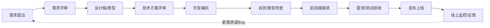
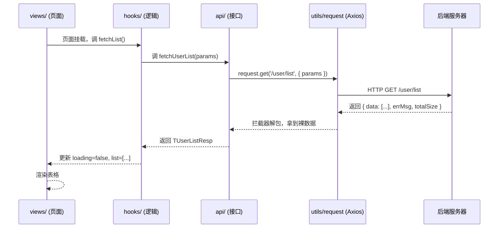
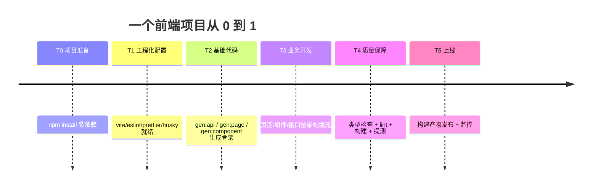
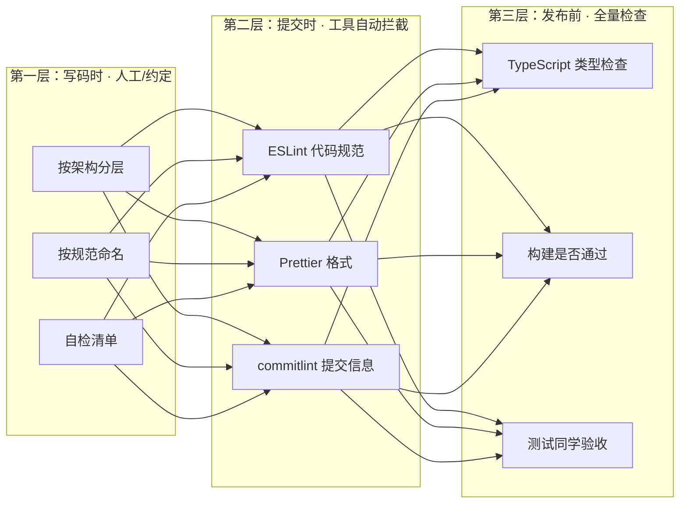

# 前端开发

| 内容 | 对应章节 |
| --- | --- |
| 前端开发一条完整链路长什么样，每个环节在做什么 | 第 1 章 |
| 一个前端项目的代码是怎么组织的，为什么这么分层 | 第 2 章 |
| 从零到一建一个项目要走哪些步骤、靠什么工具 | 第 3 章 |
| 写完代码之后，质量是怎么被保证的，测试都测些什么 | 第 4 章 |
| 前端工程师的经验怎么沉淀，AI 时代怎么一起协作 | 第 5 章 |

---

# 开场（约 3 分钟）

**讲解词：**

> 大家好。今天我想花大概半小时，带大家看一下前端开发到底是怎么一回事。
>
> 先问一句：在座的各位，有多少人觉得"前端 = 画页面"？—— 好，我看到不少人点头了。
>
> 这个印象其实只对了一半。**画页面只是前端 20% 的工作**，剩下 80% 是：数据怎么来、状态怎么管、性能怎么优化、代码怎么组织、怎么保证不会改一个地方坏一片、怎么让几十个人协作不打架。
>
> 特别是最近大家都在用 AI 写代码。你会发现一个很有意思的现象：**AI 写出来的前端页面，跑起来是挺好看的，但真正要上线的时候，你不敢让它直接上。** 为什么？因为它只给你了"页面"，没给你"工程"。
>
> 今天我就用自己维护的一个前端项目模板，带大家把"前端开发从零到一"完整走一遍：流程是什么、代码怎么组织、最后怎么测试。大家不需要会写代码，只需要带着一个好奇心就行。

**要点备忘（对主讲人）：**

- 开场互动：举手问"觉得前端就是画页面的请举手"，制造共鸣
- 抛出悬念："AI 能画页面，但不敢上线"，为第 5 章埋钩子
- 用词通俗，避免术语轰炸

---

# 第 1 章：前端开发的完整流程（约 8 分钟）

## 1.1 一张图看懂全流程



**讲解词：**

> 前端开发不是"拿到需求直接写代码"。一条完整的链路是这样的： \*\***第一步，需求评审。** 产品讲需求，前端要回答三个问题：这个功能做不做得出来？大概要多久？有没有技术风险？—— 比如你要做一个实时聊天，前端就要评估 WebSocket 方案的可行性。 \*\***第二步，设计稿。** 设计师出图，前端看的不只是"好不好看"，而是：哪些是固定尺寸、哪些要自适应、交互细节（点击、悬停、加载、空状态）怎么处理。 \*\***第三步，技术方案。** 这是前端专业度体现的地方：这个页面放哪个路由？数据从哪个接口来？要不要拆组件？状态放本地还是全局？—— 相当于开工前画图纸。 \*\***第四步，开发。** 才真正开始写代码。而且不是闷头写，要按第 2 章讲的架构分层来写。 \*\***第五步，自测。** 写完不是交给别人，自己先过三关：类型检查、代码规范检查、能不能构建通过。这些后面第 4 章会展开。 \*\***第六步，联调。** 前端代码和后端接口对数据。最经典的场景：前端说"字段叫 userName"，后端说"我返回的是 name"——联调就是消灭这种不一致。 \*\***第七步，提测。** 交给测试同学，测试不只测"点按钮有没有反应"，还会测边界：断网怎么办、空数据怎么办、快速点击会不会重复提交。 \*\***第八步，发布。** 构建产物、灰度发布、出了问题能回滚。 \*\***第九步，监控。** 上线不是结束，线上报错、性能变慢都要能看到。

## 1.2 这节想让大家记住的一件事

> **前端开发是"流程密集型"工作，不是"写代码密集型"工作。** 真正写代码的时间可能只占三分之一，其余时间都在做方案、对齐、联调、测试、发布——这也是为什么 AI 能加速"写代码"那一小段，但替代不了整条链路。

**要点备忘（对主讲人）：**

- 这节重点讲"流程多、协作多"，为后面"为什么需要架构和规范"做铺垫
- 可以举一个自己项目里的真实例子：某次联调发现的字段不一致 / 提测发现的边界 bug
- 时间紧可压缩：把九步合成"需求 → 设计 → 方案 → 开发 → 测试 → 发布"六步讲

---

# 第 2 章：前端代码架构（重点，约 15 分钟）

> 这一章是今天的重头戏。我会用一个真实的 Vue 3 + TypeScript 项目模板，把代码一层层拆开给大家看。**看不懂代码没关系，重点理解每层是干什么的、为什么要这么分。**

## 2.1 项目根目录：工程化的"管家层"

```mermaid
tree
    iframemode/  ← 项目根目录
    ├── package.json          # 项目说明书：依赖清单 + 所有命令入口
    ├── vite.config.ts        # 构建/开发服务器配置
    ├── tsconfig*.json        # TypeScript 类型检查配置
    ├── eslint.config.js      # 代码规范检查（ESLint）
    ├── .prettierrc           # 代码格式化（Prettier）
    ├── commitlint.config.js  # Git 提交信息规范
    ├── .husky/               # Git 钩子：提交前自动检查
    ├── plopfile.js           # 代码生成脚手架（核心亮点）
    ├── templates/            # 脚手架用的模板文件
    └── src/                  # ★ 业务代码全部在这
```

**讲解词：**

> 大家打开一个前端项目，第一眼看到的是根目录一堆配置文件。这些文件大部分情况"不用碰"，但它们保证了整个团队的开发方式一致。
>
> 我用生活化的比喻解释几个关键角色：
>
> - **package.json 是项目说明书。** 里面写了两件事：这个项目用了哪些依赖（就像你家的家具清单），以及有哪些命令（`npm run dev` 启动开发、`npm run build` 打包上线、`npm run lint` 检查代码）。
> - **ESLint + Prettier 是"两个纠察员"。** 一个查代码里的坏习惯（比如变量命名不规范、写死调试日志），一个负责把格式统一（缩进、引号、分号），保证一百个人写出来的代码像一个人写的。
> - **husky + commitlint 是"门卫"。** 每次你提交代码（git commit），门卫都会先检查一遍：代码格式对不对、提交信息规不规范。不合格直接拦下。
> - **plopfile.js 是本项目最有意思的部分** —— 它是一个"代码生成器"，后面第 3 章会专门讲。

## 2.2 src/ 目录

```mermaid
tree
    src/
    ├── api/         # 跟后端打交道：所有接口调用都在这（网络层）
    ├── components/  # 通用组件：可复用的 UI 积木（按钮/表格/弹窗）
    ├── hooks/       # 可复用的逻辑（如"加载数据""图表配置"）
    ├── router/      # 路由：URL 和页面的对应关系
    ├── stores/      # 全局状态：跨页面共享的数据（登录态/配置）
    ├── types/       # 类型定义：和后端数据结构的"契约"
    ├── utils/       # 工具函数：纯函数小工具
    └── views/       # 页面：一个路由对应一个页面文件夹
```

**讲解词：**

> 现在进到最核心的 `src/` 目录。前端代码为什么不能全堆在一个文件夹里？因为**分层 = 各司其职 = 好维护**。
>
> 我用一个场景来解释这八层：假设我们要做一个"用户列表"页面。
>
> - **views/** 放页面本身：长什么样、有哪些按钮、点按钮调用什么。
> - **components/** 放通用积木：表格、弹窗、表单这些组件，可能在十个页面里都用得上，所以抽出来放公共层。
> - **api/** 专门负责"怎么跟后端要数据"：`fetchUserList`、`createUser` 这些函数都在这，页面完全不关心接口地址是 `/user/list` 还是 `/user/list2`。
> - **types/** 是和后端商量好的"数据结构契约"：后端返回 `{ id, name, email }`，前端就定义一个 `TUserInfo` 类型。联调不一致时，靠它提前发现。
> - **hooks/** 把"加载数据""处理分页"这类反复出现的逻辑抽出来，页面代码就不会越写越胖。
> - **stores/** 放跨页面共享的数据：比如登录状态，几乎每个页面都要读，就放全局。
> - **utils/** 放纯工具函数：格式化时间、深拷贝这些，不碰业务。
> - **router/** 负责"URL 和页面"的对应：访问 `/user/list`，就渲染用户列表页。
>
> 八层之间不是随便乱调的，它们有固定的**依赖方向**，这就是下一节。

## 2.3 依赖方向：数据流



**讲解词：**

> 这页是前端架构里最值得记住的一张图：**一次数据请求的完整旅程**。
>
> 用户打开页面 → 页面说"我要数据" → 逻辑层接活 → 接口层知道"去哪个地址要" → 统一的网络层（Axios）真正发请求 → 后端返回 → 再一层层传回来 → 页面拿到数据渲染成表格。
>
> 为什么非要绕这么多层？三个理由：
>
> 1. **职责单一**：页面只管"展示什么"，接口层只管"去哪要"，改后端地址时只改一个文件。
> 2. **统一收口**：所有的错误提示、登录过期跳转、loading 状态，都在网络层统一处理，不会每个页面各写一套。
> 3. **类型护航**：每一层传的都是有类型的契约，传错字段编译期就报错，而不是上线后才发现。

## 2.4 组件化：为什么 UI 要拆

**讲解词：**

> 前端开发有一个核心理念叫**组件化**——把界面拆成一块块可复用的"积木"。
>
> 比如"表格"，十有八九每个后台系统都有。如果不拆，就得在十个页面里各写一遍表格代码；拆成 `BasicTable` 组件后，十个页面都调用同一个组件，改一个地方全都生效。
>
> 组件化有个很实用的决策标准（分享时可以念出来）：
>
> - 一个组件超过 200 行？→ 拆
> - 同一段 UI 出现过 2 次以上？→ 抽成组件
> - 这个块有自己的加载/空状态/错误处理？→ 抽成组件
> - 都不是？→ 先放着，别过度设计

## 2.5 状态管理：数据放哪

```mermaid
flowchart TD
    A[这个状态只在当前组件用？] -->|是| B[放组件本地 ref]<br/>（第一选择）
    A -->|否| C[只在父子组件间传递？]
    C -->|是, ≤2层| D[props 向下传]
    C -->|是, ≥3层| E[provide / inject 提供共享]
    C -->|否| F[多个无关组件都要用？]
    F -->|是| G[放全局 store]<br/>（登录态/配置/跨页缓存）
    F -->|否| B
```

**讲解词：**

> 前端有个经典难题：**这个数据该放哪？** 放错地方，代码很快就乱。
>
> 经验法则一句话：**状态离使用者越近越好，能放本地就不放全局。**
>
> - 一个弹窗开不开、一个表单输入到哪了 → 放组件本地，别动不动就上全局。
> - 登录状态、用户信息、系统配置 → 几乎每个页面都要读，才放全局 store。
>
> 新手常犯的错误：什么东西都塞全局 store，最后全局状态像一个大杂烩，改一处不知道会影响哪里。

**要点备忘（对主讲人）：**

- 2.2 是全场最重要的图，讲慢一点，确保听众理解"分层"这个概念
- 2.3 数据流图建议对着项目里真实的 `src/api/tag.ts` + `src/utils/request.ts` 指给大家看
- 2.5 的决策树是本项目 `.claude/sop/通用/08-状态管理规范.md` 的简化版

---

# 第 3 章：从 0 到 1 建一个项目（约 8 分钟）

> 前面讲了架构长什么样，这一章讲**一个项目是怎么从零到一被建起来的**。这章会现场敲命令演示，是互动性最强的一节。

## 3.1 三步走：安装依赖 → 生成代码 → 跑起来

```bash
# 第一步：安装依赖
npm install

# 第二步：启动开发服务器
npm run dev

# 第三步：浏览器打开 http://localhost:5173 看到页面
```

**讲解词：**

> 传统做法建一个前端项目，要先手动装十几个依赖、配一堆配置文件、写基础目录结构——新手可能要折腾一下午。
>
> 这个模板把依赖、配置、目录结构和规范都沉淀好了。进入项目后执行 `npm install` 和 `npm run dev`，就能直接开始业务开发。

## 3.2 代码生成器：为什么项目里要有"脚手架"

**讲解词：**

> 项目搭起来之后，业务开发经常是大量重复的结构：每加一个模块，就要建一个 API 文件、一个类型文件、一个页面文件夹……手写又慢又容易漏。
>
> 于是模板里内置了一个**代码生成器**（用 Plop 实现），几条命令就能生成符合规范的标准骨架：

```bash
# 生成一个 API 模块（自动创建 src/api/report.ts + src/types/report.ts）
npm run gen:api -- report

# 生成一个页面骨架（自动创建 views/xxx/ + components）
npm run gen:page -- user-list

# 生成一个通用组件（自动创建 src/components/BasicTable.vue）
npm run gen:component -- BasicTable
```

**讲解词：**

> 我们现场演示一个：我要加一个"报表"模块，只需要跑 `npm run gen:api -- report`。
>
> 看，它自动生成了两个文件：
>
> - `src/api/report.ts` —— 已经写好了 `fetchReportList`、`fetchReportDetail` 等标准接口函数，URL 前缀也自动带上 `/report`；
> - `src/types/report.ts` —— 已经定义好了 `TReportInfo`、`TReportListReq` 等类型骨架，还自动挂到了类型汇总文件里。
>
> 为什么强调"符合规范"？因为生成的不是随便一段代码，而是**长在团队规范里的标准骨架**——命名、结构、类型继承全部符合要求。这比让 AI 自由发挥更可控，因为它生成的每一行都是"已知好"的代码。

## 3.3 从 0 到 1 的完整时间线（回顾）



**要点备忘（对主讲人）：**

- 3.2 强烈建议**现场演示**一次 `gen:api`，让听众看到"生成的文件长什么样"
- 如果现场不方便敲命令，可以提前把生成后的文件内容截图/打开给听众看
- 强调：脚手架生成的是"规范化的代码"，不是随便一段代码——这是本项目区别于普通模板的核心

---

# 第 4 章：代码测试与质量保障（约 8 分钟）

> 很多不懂前端的人以为"测试 = 测试同学点点点"。其实前端质量保障是一套**层层拦截**的体系，大部分问题在提交前就被工具拦下来了。

## 4.1 质量保障的"三层拦截"



**讲解词：**

> 前端质量保障不是"最后测一次"，而是**每一层都有人/工具把守**。 \*\***第一层：写码时。** 开发同学按架构写、按规范命名，写完对照自检清单自己检查一遍。这层靠的是经验和习惯。 \*\***第二层：提交时（自动）。** 这是传统前端开发和 AI 生成代码最大的区别之一：当你执行 `git commit` 提交代码时，项目里的"门卫"（husky + lint-staged）会自动跑起来——
>
> - ESLint 检查代码规范：有没有写死调试日志、有没有变量没用到、命名合不合规；
> - Prettier 统一格式：缩进、引号、分号自动修；
> - commitlint 检查提交信息：必须是 `feat: xxx` / `fix: xxx` 这种规范格式。
>
> 不合格？**直接拦截，提交不成功**，把问题当场反馈给你。 \*\***第三层：发布前。** 类型检查确保所有数据结构的"契约"是对的；构建确保代码能真正打包上线；最后才交给测试同学做业务验收。

## 4.2 一次真实拦截（现场演示脚本）

**讲解词：**

> 我现场演示一下"门卫"是怎么工作的。
>
> 我故意在代码里加一个调试日志 `console.log`（规范里是禁止的），然后提交：

```bash
# 假设在代码里写了 console.log('debug')
git add .
git commit -m "test: 故意提交调试日志"
# → pre-commit 钩子触发 eslint --fix
# → 输出: error  Unexpected console statement  no-console
# → 提交被拦截，需要先删掉或改成 console.warn
```

**讲解词：**

> 看，提交被拦下来了，ESLint 直接报错。这就是为什么团队代码里不会出现调试日志、不会出现没用的变量——**不是靠大家自觉，而是靠工具强制。**
>
> 这也回答了开场的问题：为什么 AI 生成的代码"能跑但不敢上线"？因为 AI 只生成了"页面"，没有这套质量保障体系去拦截问题。

## 4.3 各种"测试"分别测什么（给非前端听众的对照表）

| 检查项 | 通俗解释 | 什么时候跑 | 谁在管 |
| --- | --- | --- | --- |
| 类型检查 | 检查"数据结构契约"对不对，字段名/类型不能错 | 提交前 / 构建前 | 工具（vue-tsc） |
| 代码规范（Lint） | 检查代码写得好不好：命名、死代码、调试日志 | 提交时自动 | 工具（ESLint） |
| 格式（Format） | 统一风格：缩进、引号、分号 | 提交时自动 | 工具（Prettier） |
| 构建（Build） | 能不能真正打包成上线产物 | 发布前 | 工具（Vite） |
| 单元测试 | 单个函数/组件逻辑对不对 | CI / 开发时 | 开发者写测试用例 |
| 端到端测试 | 模拟用户完整操作流程 | CI / 发版前 | 测试 / 自动化 |
| 人工验收 | 产品、测试按需求确认体验 | 提测阶段 | 测试 / 产品 |

**要点备忘（对主讲人）：**

- 4.2 现场演示是全场记忆点，提前确保 husky 已安装（`npm install` 时自动 `prepare: husky`）
- 如果不方便演示拦截，可以演示 `npm run lint` 手动检查
- 强调核心信息：**传统开发的质量保障是"体系"，不是"最后的测试"**

---

# 第 5 章：延伸——传统经验 + AI（约 5 分钟）

> 前面讲的是传统前端开发的完整链路。这一章回答大家最关心的问题：**那 AI 呢？我直接用 AI 生成代码不行吗？**

## 5.1 我的答案：AI 很好用，但要让 AI 按"架构"来写

**讲解词：**

> AI 写前端代码的能力确实很强，它能在几秒钟内生成一个漂亮的页面。但问题是：**AI 默认生成的是"一次性页面"，不是"可持续的工程"。**
>
> 它会乱建文件、不用类型、不按分层，页面多了以后，代码没法维护。
>
> 所以我在传统开发的整套经验之上，沉淀了一套"给 AI 看的规范"——把这套项目模板本身变成了一个 AI 也能遵守的工程。

## 5.2 本项目里的 SOP 四层框架（简单带过）

```mermaid
flowchart TB
    S1[① 规范文档]<br/>.claude/sop/ 12篇规范
    --> S2[② 脚手架]<br/>plop 生成器
    --> S3[③ 自动校验]<br/>husky + lint-staged + commitlint
    --> S4[④ 路由入口]<br/>根目录 CLAUDE.md → AGENTS.md
    S4 -.->|AI/人 按场景读对应规范| S1
```

**讲解词：**

> 我把前面讲的所有传统经验——目录怎么分、命名怎么定、API 怎么写、状态放哪、提交信息格式——**全部写成了规范文档**（放在 `.claude/sop/` 里），然后做了三件事：
>
> 1. **脚手架**：把规范变成一键生成，AI 或人跑 `gen:api` 生成的骨架天然符合规范；
> 2. **自动校验**：提交时工具强制拦截不符合规范的代码；
> 3. **路由入口**：根目录 `CLAUDE.md` 只负责导入 `AGENTS.md`，由 `AGENTS.md` 提供场景路由表，AI 接手项目时先从这里定位需要阅读的规范。
>
> 这样，**AI 写出来的代码，也能落进传统架构里**：它有正确的分层、有类型、能被工具校验、能被同事 review。

## 5.3 给用 AI 开发的人的 3 条建议

**讲解词：**

> 最后给在场用 AI 开发的同学三条建议：
>
> 1. **先立架构，再让 AI 干活。** 先定好目录分层、类型约定、组件规范，再让 AI 在框架里填空，而不是让它从零自由发挥。
> 2. **让 AI 生成的代码过一遍工程检查。** 跑 `npm run lint` / `npm run type-check`，不合格就让 AI 修，直到通过。
> 3. **把重复的成功做法沉淀下来。** 你手搓代码的经验、AI 用着顺手的模式，都可以写成规范文档/脚手架，让下次更快。

**要点备忘（对主讲人）：**

- 这章不是主角，控制在 5 分钟内，避免喧宾夺主
- 如果听众里后端/测试多，可以强调：这套体系同样适合后端项目（决策规则不变，换技术栈实现）

---

# 收尾：带走三件事 + Q&A（约 5 分钟）

**讲解词：**

> 今天内容不少，最后帮大家收一下，记住三件事就够了： \*\***第一，前端开发是一条完整的流程链**：需求 → 设计 → 方案 → 开发 → 联调 → 测试 → 发布 → 监控，写代码只是中间一小段。 \*\***第二，代码架构的核心是分层**：页面、组件、接口、类型、状态各司其职，数据沿着固定的方向流动，这样代码才能长期维护。 \*\***第三，质量不是最后测出来的，是层层拦出来的**：写码自检、提交时工具拦截、发布前全量检查——这就是传统开发和 AI 一键生成最大的区别。
>
> 如果你用 AI 开发，记住一句话：**让 AI 在工程框架里填空，而不是从零自由发挥。**
>
> 谢谢大家，欢迎提问。

---

# 附录 A：目录架构速查表（一页版）

> 分享时可以投影这页，作为"目录架构"的小抄。

| 路径 | 职责 | 类比 |
| --- | --- | --- |
| `package.json` | 项目说明书：依赖 + 命令 | 简历 |
| `vite.config.ts` | 构建/开发服务器 | 工厂流水线 |
| `eslint.config.js` | 代码规范检查 | 纠察员 |
| `.prettierrc` | 代码格式化 | 排版员 |
| `.husky/` + `lint-staged` | 提交前自动检查 | 门卫 |
| `commitlint.config.js` | 提交信息规范 | 门卫之二 |
| `plopfile.js` + `templates/` | 代码生成脚手架 | 预制件工厂 |
| `src/api/` | 接口调用层 | 外交官 |
| `src/components/` | 通用组件 | 乐高积木 |
| `src/hooks/` | 可复用逻辑 | 工具箱 |
| `src/router/` | URL 与页面映射 | 导航地图 |
| `src/stores/` | 全局共享状态 | 中央数据库 |
| `src/types/` | 数据结构契约 | 合同文本 |
| `src/utils/` | 纯函数工具 | 瑞士军刀 |
| `src/views/` | 页面（一路由一目录） | 房间 |

---

# 附录 B：演示命令清单

```bash
# 1. 启动开发服务器（演示用）
npm install
npm run dev

# 2. 代码生成器演示
npm run gen:api -- report
npm run gen:page -- user-list
npm run gen:component -- BasicTable

# 3. 质量保障演示
npm run lint          # 代码规范检查
npm run type-check    # 类型检查
npm run build         # 构建
npm run format        # 格式化

# 4. 提交拦截演示（提前准备：故意写一行 console.log）
git add .
git commit -m "test: 演示提交拦截"
```

---

# 附录 C：Q&A 预案（8 题）

**Q1：我不会前端，能用 AI 直接做个页面吗**？可以，但建议先套一个工程模板（就像本项目），让 AI 在框架里生成，而不是从零写。否则页面一多就没法维护。

**Q2：这套架构是 Vue 专属吗？换 React 怎么办**？分层思想（页面/组件/接口/类型/状态）是所有前端框架通用的；换技术栈时，脚手架模板和技术栈规范文件整体替换即可，决策规则不变。

**Q3：为什么非要分层？直接写不更简单吗**？单页确实更简单，但项目一大（几十个页面、多人协作），不分层会"改一处崩一片"。分层是花小钱（前期多点结构）省大钱（后期好维护）。

**Q4：提交拦截会不会很烦？影响效率吗**？初期会有点烦，但习惯后是收益：90% 的低级错误（格式、死代码、类型错）在提交前就被拦下，省掉的 review 和返工时间远大于代价。

**Q5：代码生成器生成的骨架，AI 能直接用吗**？可以。生成器产出的是符合规范的标准骨架，AI 或人在骨架上填充业务逻辑即可，这也是本项目让 AI 协作的关键设计。

**Q6：测试不是测试同学的事吗？前端为什么要做这么多检查**？测试同学做的是业务验收；类型检查/Lint/构建是开发阶段的质量门禁，属于"不把低级问题留给测试"。两类工作互补，不是重复。

**Q7：这个模板的规范，维护成本谁承担**？规范是"活的"：开发中发现新问题就补一条规则（写在 `.claude/sop/` 对应文件里）。成本很低，收益是团队越写越一致。

**Q8：我想在自己的项目里用，怎么开始**？两步：① 复制模板并按项目实际情况调整 `package.json`；② 让团队一起遵守规范，遇到分歧按规范文档为准，需要调整就改文档。

> **制作信息**：本演讲稿配套项目模板 iframeMode-template（Vue 3 + TypeScript + Ant Design Vue），所有架构图与命令均可在项目中验证。 建议分享前对照项目实际跑一遍附录 B 的命令，确认演示环境就绪。