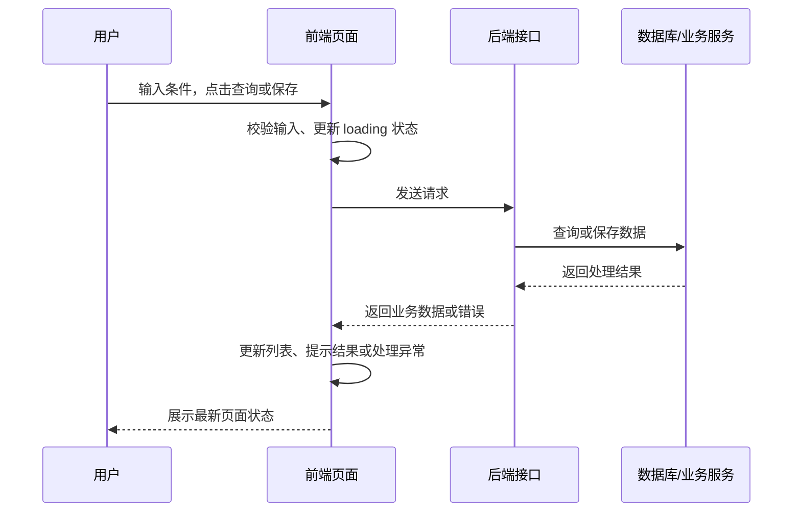
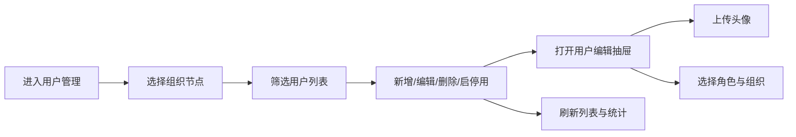
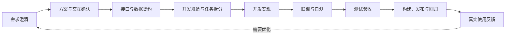
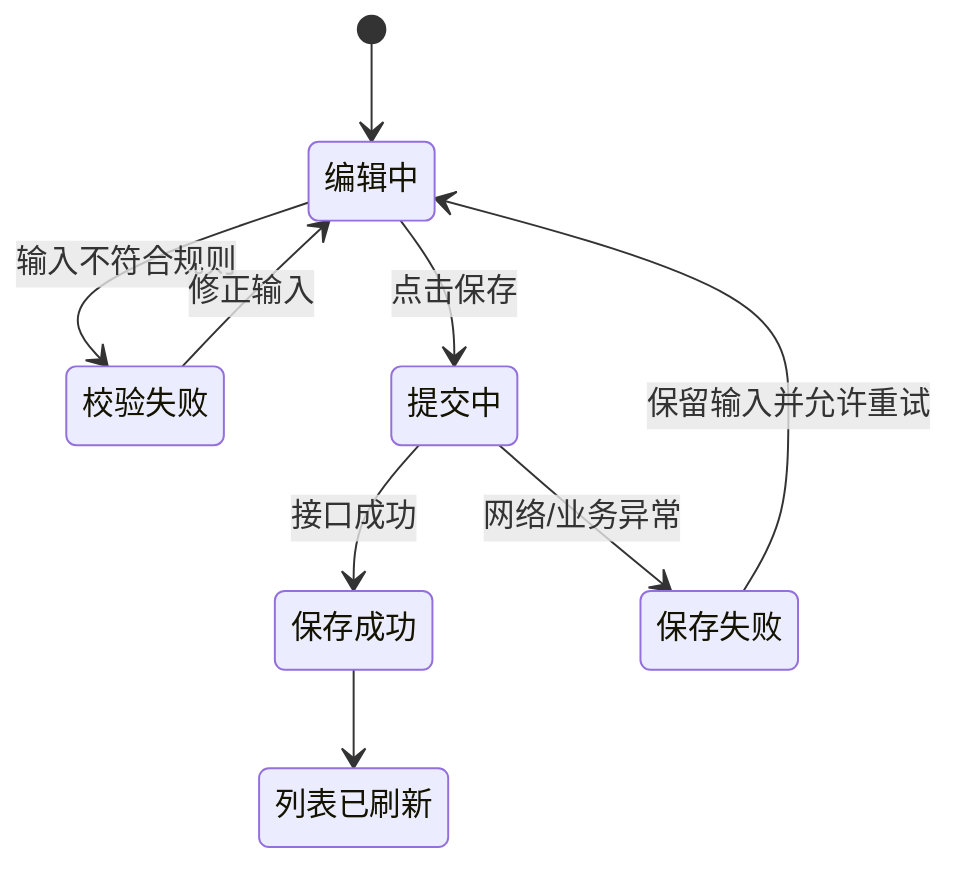
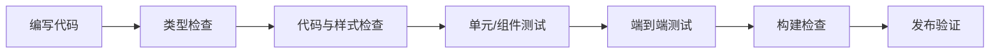

# 前端开发分享：以“用户管理工作台”为例，如何稳定交付一个功能

> **分享主线**：前端开发不是把一个列表页面画出来，而是把组织关系、用户数据、权限、表单、上传、统计、异常和工程质量组合成一个可用、可维护、可验证的管理功能。
>
> **案例说明**：本文以“用户管理工作台”作为贯穿式设计案例。它不是当前仓库已经实现的完整业务页面，而是基于当前 `iframeMode-template` 已有能力设计的综合案例。案例包含左侧组织树、右侧用户列表、新增/编辑抽屉、头像上传、用户统计、权限状态和 iframe 嵌入场景。

---

## 目录

| 部分 | 内容 |
| --- | --- |
| 1 | 一个管理工作台背后，前端到底负责什么 |
| 2 | 用户管理工作台如何从需求走到稳定交付 |
| 3 | 代码和技术如何支撑这个综合功能 |
| 4 | 为什么“页面能打开”还不够 |
| 5 | AI 如何真正帮助前端开发 |

---

## 1. 一个页面背后，前端到底负责什么

### 开场讲稿

大家可以先想一个问题：如果现在产品同事说，“我们需要一个用户管理页面”，前端是不是拿到设计图后直接写表格和按钮就可以了？

实际开发中，通常还不能马上写代码。因为一个真正的用户管理功能，可能不仅是一张列表，还包括组织筛选、权限控制、用户新增和编辑、头像上传、角色分配、统计信息以及嵌入其他系统后的显示方式。

我们至少需要确认：

- 列表展示哪些字段？账号、姓名、角色、状态还是创建时间？
- 用户能做哪些操作？新增、编辑、删除、启用、停用是否都需要？
- 不同角色的用户看到的按钮是否一样？
- 数据还没有回来时显示什么？没有数据时显示什么？
- 接口失败、登录过期、没有权限时，用户会看到什么？
- 删除一条数据后，当前页没有数据了，页面应该停留在这一页还是自动回到上一页？

这些问题说明，前端需要把用户操作、页面交互、后端数据和真实使用场景组织起来，让用户能够稳定、清楚地完成任务。

前端在这里承担的是连接用户操作与系统能力的职责。

### 前端在一次操作中做了什么

用户看到的是“点击查询”或“点击保存”，但背后通常会经过下面的链路：



前端要负责的不只是页面结构，还包括：

| 前端职责 | 用户管理工作台中的例子 |
| --- | --- |
| 页面展示 | 组织树、用户表格、统计卡片、搜索区和操作入口 |
| 交互逻辑 | 选择组织、查询、分页、新增、编辑、删除、启用和停用 |
| 数据通信 | 获取组织树、用户列表、统计数据，提交用户信息和上传文件 |
| 数据共享 | 登录用户、权限、当前组织或系统配置等跨页面状态 |
| 组件复用 | 树形布局、抽屉、上传、图表等通用能力 |
| 状态管理 | loading、空数据、保存中、上传中、统计加载和错误恢复 |
| 质量保障 | 类型检查、代码检查、组件测试、E2E、构建与发布验证 |

### 本次案例：用户管理工作台

后面所有内容都会围绕一个更接近企业后台真实形态的“用户管理工作台”展开。用户列表仍然是核心区域，但它会和组织、权限、表单、上传、统计及嵌入场景组合起来。



这个工作台可以拆成几个区域：

用户管理工作台是一个典型的企业后台综合功能，建议至少覆盖：

| 模块 | 具体业务 | 体现的前端能力 |
| --- | --- | --- |
| 组织管理 | 组织树、部门层级、节点选择与展开/收起 | 树形数据、布局组件、联动查询 |
| 用户列表 | 搜索、分页、状态筛选、批量或单条操作 | 表格、表单、分页、页面状态 |
| 用户维护 | 新增、编辑、角色分配、启用/停用、删除确认 | 抽屉表单、校验、权限和异常处理 |
| 文件处理 | 头像上传或用户导入 | `FormData`、文件校验、上传状态 |
| 数据统计 | 当前组织用户总数、状态分布、角色分布 | ECharts、option 更新、resize |
| 权限控制 | 页面、组织节点和按钮级权限 | Pinia 共享状态 + 后端鉴权 |
| 系统集成 | iframe 嵌入、Hash 路由、生产环境显示策略 | Router、App 外壳、容器适配 |

---

## 2. 用户管理工作台如何从需求走到稳定交付

### 讲稿

前面说过，前端开发不是从写代码开始。更完整地说，一个功能要经历“**把事情说清楚 → 把方案定下来 → 把代码做出来 → 证明它可以交付**”四个阶段。

以用户管理工作台为例，真正的流程不是一条简单直线，而是一个会在关键节点回看、校正的闭环：接口字段不够时要回到接口约定；测试发现异常场景遗漏时要回到交互设计；上线后发现真实使用方式与预期不同，也需要再进入下一轮优化。



下面用用户管理工作台来说明：每个阶段前端要关注什么、会产出什么，以及什么情况下才能进入下一步。

### 2.1 需求澄清：先把“做什么、为什么做”说清楚

如果只说“做一个用户管理工作台”，信息仍然远远不够。前端首先要理解这个页面要帮谁完成什么任务，再把口头描述转化成可执行的规则。

| 需要确认的内容 | 用户管理工作台中的例子 | 阶段产出 |
| --- | --- | --- |
| 页面目标 | 按组织管理用户，并支持查看、维护和统计人员状态 | 一句清楚的页面目标 |
| 使用角色 | 谁可以查看组织、编辑用户、上传头像或删除用户？ | 角色与权限范围 |
| 展示内容 | 用户字段、所在组织、角色、状态、头像和统计指标分别展示在哪里？ | 字段与区域清单 |
| 操作范围 | 是否可以新增、编辑、删除、启用、停用、上传头像？ | 操作清单与入口规则 |
| 业务规则 | 已被业务引用的用户能否删除？组织切换是否影响可选角色？ | 关键业务规则 |
| 嵌入约束 | 页面由哪个系统嵌入，访问路由、容器尺寸和登录态如何保持？ | 集成与运行约束 |
| 异常规则 | 请求、上传、保存失败、无权限、登录过期时如何处理？ | 异常与提示原则 |
| 验收标准 | 哪些操作算成功，哪些边界场景必须验证？ | 可测试的验收清单 |

可以这样理解：**需求澄清不是增加流程，而是尽早发现返工。**

例如，“删除用户”表面上只有一个按钮，但至少要确认：是否二次确认、删除后是否可恢复、当前页最后一条数据删除后怎么办、删除失败如何提示、不同角色是否都能删除。若这些问题在开发后期才发现，往往意味着页面、接口和测试都要返工。

进入下一阶段的最低标准是：团队能用一句话说明页面目标，能列出主要操作、权限边界和验收条件，而不只是拥有一张静态设计图。

### 2.2 方案与交互确认：设计不只有正常页面

需求说清楚之后，需要把它变成用户实际会经历的操作路径。设计不能只关注“数据正常时页面长什么样”，还要确认页面在各种状态下是否仍然清楚、可恢复、可继续操作。

用户管理工作台建议至少明确：

- 首次进入：组织树、统计和用户列表是否并行加载，各自的 loading 如何展示；
- 组织筛选：选择部门后列表和统计如何联动，是否重置页码；
- 查询：搜索条件有哪些，修改条件后页码是否回到第一页；
- 列表：字段过多时如何展示，状态和所属组织如何标识；
- 空数据：当前组织没有用户时，是提示“暂无用户”，还是引导用户新增；
- 新增和编辑：使用弹窗还是抽屉；哪些字段必填，角色与组织如何选择；
- 上传头像：限制哪些文件类型和大小；上传失败后是否保留表单输入；
- 删除：是否需要二次确认，危险操作如何让用户理解后果；
- 保存中：确认按钮是否禁用，如何避免重复提交；
- 异常：列表、统计或上传分别失败时显示什么，表单输入是否保留；
- 无权限：页面入口、组织节点、操作按钮是隐藏、禁用还是提示；前端体验如何与后端权限校验配合；
- iframe 嵌入：嵌入容器尺寸变化时页面与图表如何适配，生产环境是否隐藏开发菜单。

可以把一个核心操作画成状态变化，而不仅是一张页面图：



这一阶段应产出页面原型或交互说明、状态清单，以及需要产品、设计、后端共同确认的开放问题。这样开发者拿到的不是“照图实现”，而是明确的用户行为规则。

### 2.3 接口与数据契约：前后端对“数据长什么样、失败怎么办”达成一致

页面和后端接口是两个独立系统，必须在开发前建立共同契约。接口约定不只包括地址和请求方法，还包括字段含义、分页规则、错误码、权限边界和异常时的返回结构。

当前模板中公共分页请求使用 `page` 与 `pageSize`，公共分页结果使用 `list`、`total`、`page`、`pageSize`、`totalPage`。新增业务时，应优先复用这套契约，而不是每个页面各自定义一套字段。

例如，用户管理工作台中的用户列表查询参数可以设计为：

```ts
type TUserStatus = 'enabled' | 'disabled'

type TUserListParams = {
  account?: string
  page: number
  pageSize: number
  status?: TUserStatus
}
```

用户数据可以设计为：

```ts
type TUser = {
  account: string
  id: number
  name: string
  status: TUserStatus
}
```

除了字段类型，实际协作时还要确认：

| 接口问题 | 用户管理工作台中的例子 |
| --- | --- |
| 组织树 | 是否一次返回整棵树；切换节点后传组织 ID 还是组织路径？ |
| 用户列表 | 不传状态时是查询全部，还是只查询启用用户？ |
| 分页边界 | 页码从 1 还是 0 开始；删除最后一条后返回哪一页？ |
| 统计数据 | 统计是否跟随当前组织和搜索条件，还是展示全局数据？ |
| 上传 | 文件先上传再保存用户，还是与表单一起提交；返回文件地址还是文件 ID？ |
| 空结果 | 成功但没有数据时，返回空 `list` 还是错误？ |
| 业务失败 | 用户不存在、账号重复、不能删除或文件不合规时返回什么业务码和提示？ |
| 权限校验 | 前端隐藏按钮之外，后端是否拦截无权请求？ |
|  |

这一阶段的产出是接口文档或接口清单、字段示例、错误场景约定和可用于联调的测试数据。这样做的价值是：字段写错、状态值传错、分页参数不一致等问题，可以在开发阶段更早暴露，而不是等到上线后才发现。

### 2.4 开发准备：先拆清楚，再开始写代码

接口和交互确认后，前端不应该把所有内容直接堆到一个页面里，而是先按职责拆分工作。以用户管理工作台为例，可以拆成：

| 工作项 | 需要完成的内容 | 依赖 |
| --- | --- | --- |
| 页面入口与嵌入 | 路由、菜单/iframe 入口、容器适配与权限入口 | 页面地址、嵌入方式与权限规则 |
| 数据模型 | 用户、组织树、角色、统计、查询参数、分页、表单和上传类型 | 接口字段契约 |
| 接口层 | 组织树、用户列表、统计、新增、编辑、删除、状态变更、上传函数 | 后端接口文档 |
| 页面主体 | 左侧树、右侧统计、搜索区、表格和分页 | 交互稿与字段清单 |
| 页面局部组件 | 用户新增/编辑抽屉、角色选择、表单校验 | 表单规则 |
| 通用组件复用 | 树形布局、抽屉、上传、图表 | 现有 `components/` 能力 |
| 共享状态 | 登录用户、权限、当前组织或系统配置 | `stores/` 状态边界 |
| 页面 Hook | 用户查询、组织联动、统计 option 等页面复用逻辑 | 交互与数据契约 |
| 状态与异常 | loading、提交中、上传中、空状态、错误恢复 | 交互与错误码约定 |
| 测试 | 关键逻辑、组件交互、浏览器流程 | 验收清单 |

这一阶段也要先检查项目已有能力：有没有可复用的树形布局、抽屉、上传、图表、请求封装和权限 Store；只有确实缺少时才新增通用能力。**先复用、后抽象，避免为了“看起来通用”而过早设计。**

开发开始前，最好让团队能回答三个问题：文件分别放在哪里？接口是否可以调用或模拟？关键完成标准是什么？这三个问题有答案，开发过程通常会顺畅很多。

因此，交付前需要将需求、交互、接口、代码和真实环境逐项核对，确保关键操作及其失败恢复方式都符合约定。

---

## 3. 代码和技术如何支撑这个综合功能

### 讲稿

当需求、交互和接口都明确后，才进入代码实现。这里最重要的不是把代码拆得越细越好，而是让每一类代码有清晰职责，让后续维护者能快速找到它、理解它、修改它。

### 3.1 新增用户管理业务时，文件应该如何组织

当前项目是 Vue 3 + TypeScript 的工程模板。假设后续新增用户管理工作台，可以按照下面的职责组织文件：

```text
src/
├── api/
│   └── system/
│       └── user.ts                  # 用户、组织、统计、上传等接口函数
├── types/
│   └── system/
│       └── user.ts                  # 用户、组织、角色、分页和表单类型
├── views/
│   └── system/
│       └── user/
│           ├── components/
│           │   ├── UserFormDrawer.vue # 当前页面专属的新增/编辑抽屉
│           │   └── UserStatistics.vue # 当前页面专属的统计区域
│           └── index.vue             # 用户管理工作台主体
├── components/                       # 可被多个页面复用的通用组件
│   ├── BasicChart.vue                # 图表展示
│   ├── BasicUpload.vue               # 文件上传
│   ├── DrawerDialog.vue              # 抽屉容器
│   └── TreeWrapper.vue               # 左树右内容布局
├── hooks/
│   ├── useChart.ts                   # 图表生命周期与尺寸处理
│   └── useUserManagement.ts          # 用户列表、组织联动、统计刷新等页面逻辑
├── stores/                            # 跨页面共享的登录用户、权限等状态
│   └── auth.ts                       # 登录用户、Token、权限标识
├── router/                           # 页面地址与页面组件的对应关系
└── utils/
    ├── echarts.ts                    # ECharts 按需注册
    └── request.ts                    # 统一请求封装
```

判断一段代码放在哪里，可以用几个简单的问题：

| 判断问题 | 建议位置 |
| --- | --- |
| 只属于当前页面吗？ | 放在当前 `views/` 页面目录 |
| 多个页面都会复用界面吗？ | 放入 `components/` |
| 多个页面都会复用逻辑吗？ | 放入 `hooks/` |
| 是接口通信吗？ | 放入 `api/` |
| 是数据结构和字段约束吗？ | 放入 `types/` |
| 是跨页面共享数据吗？ | 再考虑放入 `stores/` |
| 是基础工具能力吗？ | 放入 `utils/` |

这套分层的目的不是形式化，而是避免所有逻辑堆在一个页面文件中，导致后期难以维护。

### 3.2 页面如何组合模板提供的基础能力

这个综合案例的价值在于：每个模板能力都对应一个具体业务问题，而不是为了展示目录而展示目录。

#### 组织树与用户列表：`TreeWrapper.vue`

左侧组织树负责选择部门或组织节点，右侧内容根据当前节点展示用户列表和统计数据。`TreeWrapper.vue` 提供左树右内容的布局和展开/收起能力；具体的组织树数据和用户查询仍由业务页面负责。

当用户选择“研发部”时，页面需要：

1. 保存当前组织 ID；
2. 将用户列表页码重置为第一页；
3. 重新请求用户列表；
4. 同步刷新当前组织的统计信息；
5. 在加载、空数据和请求失败时分别给出反馈。

#### 新增/编辑用户：`DrawerDialog.vue`

用户信息字段较多时，抽屉通常比小弹窗更适合承载表单。`DrawerDialog.vue` 只负责抽屉的打开、关闭和确认/取消事件，用户业务表单放在页面私有组件中。

这样可以把通用能力和业务能力分开：通用抽屉不知道什么是用户；用户表单也不需要重新实现抽屉的基础行为。

#### 头像上传：`BasicUpload.vue`

用户新增或编辑时可能需要上传头像。`BasicUpload.vue` 负责文件类型校验、生成 `FormData` 和输出上传事件；页面或 API 层负责调用真实上传接口、保存文件地址，并处理上传中和上传失败状态。

这里还需要明确一个业务决策：头像是先上传成功后再提交用户信息，还是由后端在一次请求中统一处理。前端不能只根据组件名称猜测接口流程。

#### 用户统计：`BasicChart.vue` 与 `useChart.ts`

工作台可以在列表上方展示当前组织的用户总数、启用/停用数量或角色分布。`BasicChart.vue` 负责图表组件的展示，`useChart.ts` 负责初始化、option 更新、窗口 resize 和组件卸载时销毁实例。

如果用户切换组织，统计 option 需要更新；如果左侧组织树展开或收起，图表容器宽度变化，页面应主动调用图表刷新能力，或在业务中补充容器尺寸监听。不要假设图表会自动感知所有布局变化。

#### 共享权限：`stores/`

登录用户、角色权限、当前系统配置等跨页面都需要的数据，适合由 Pinia Store 管理。当前页面的查询条件、loading、抽屉开关和列表数据属于页面临时状态，不应该因为“用了 Pinia”就全部放到 Store 中。

因此用户管理工作台还需要验证：宿主系统能否打开正确路由、相对资源路径是否正常、登录态是否可用、iframe 容器尺寸变化时列表和图表是否正常。

### 3.3 路由负责“用户怎么进入页面”

页面文件存在，不代表用户或宿主系统就能访问。还需要在路由配置中声明页面地址与组件的关系。

```ts
{
  component: () => import('@/views/system/user/index.vue'),
  meta: {
    title: '用户管理',
  },
  name: 'SystemUser',
  path: '/system/user',
}
```

这里不需要记住具体语法，只需理解：

- `path` 决定访问地址；
- `component` 指向要显示的页面；
- `meta.title` 可用于菜单、标签页或页面标题；
- `name` 方便代码识别路由。

当前模板已使用 Vue Router 的 Hash 路由方式，并在 `main.ts` 中注册 Router、Pinia 和 Ant Design Vue；新增业务页面只需要在既有结构中接入即可。

### 3.4 页面、接口和状态如何协作

用户管理工作台的主体通常包含：左侧组织树、右侧统计区、搜索区、操作区、用户表格和用户抽屉。

```vue
<template>
  <section class="user-page">
    <TreeWrapper :is-show-btn="true">
      <template #tree>
        <a-tree @select="handleOrganizationSelect" />
      </template>
      <template #content>
        <UserStatistics :option="statisticsOption" />

        <a-form layout="inline">
          <a-form-item label="账号">
            <a-input v-model:value="query.account" placeholder="请输入账号" />
          </a-form-item>
          <a-form-item label="状态">
            <a-select v-model:value="query.status" allow-clear />
          </a-form-item>
          <a-button type="primary" @click="handleSearch">查询</a-button>
          <a-button @click="resetQuery">重置</a-button>
        </a-form>

        <a-button type="primary" @click="openCreate">新增用户</a-button>

        <a-table
          row-key="id"
          :columns="columns"
          :data-source="users"
          :loading="loading"
          :pagination="pagination"
          @change="handleTableChange"
        />
      </template>
    </TreeWrapper>

    <UserFormDrawer @success="refreshUserData" />
  </section>
</template>
```

页面只负责组织交互和页面临时状态；具体“如何请求组织树、用户列表、统计、上传和保存用户”应放到接口文件中：

```ts
import request from '@/utils/request'

import type { TApiResponse, TPageResult } from '@/types/common'
import type { TUser, TUserListParams } from '@/types/system/user'

export function fetchUserListApi(params: TUserListParams) {
  return request.get<TApiResponse<TPageResult<TUser>>>('/system/users', {
    params,
  })
}

export function uploadUserAvatarApi(data: FormData) {
  return request.post<TApiResponse<{ fileId: string; url: string }>>(
    '/system/users/avatar',
    data,
  )
}
```

这种分工的好处是：页面不需要到处直接写 Axios 请求；接口地址、参数和返回类型集中在 `api/` 与 `types/` 中，更容易复用、测试和调整。页面的列表、组织树、统计和表单可以独立加载或刷新，也不会相互缠绕。

### 3.5 当前模板的请求封装解决了什么问题

项目中的 `src/utils/request.ts` 已经封装了 Axios 请求能力，统一处理：

- 请求时注入 `Authorization` Token；
- 统一解析后端 `code / message / data` 响应结构；
- 业务错误码的错误提示；
- `401` 登录过期时清除 Token 并跳转登录页；
- `403` 无权限提示；
- 网络异常与开发环境错误日志。

因此，页面不建议直接这样写：

```ts
const response = await axios.get('/system/users')
users.value = response.data.records
```

这种写法的问题是：每个页面都可能重复处理 Token、错误和字段解析，而且 `records` 也未必符合当前项目的分页契约。

更推荐页面只关注自身状态：

```ts
const loading = ref(false)
const total = ref(0)
const users = ref<TUser[]>([])
const query = reactive<TUserListParams>({
  page: 1,
  pageSize: 10,
})

async function loadUsers() {
  loading.value = true

  try {
    const result = await fetchUserListApi(query)
    total.value = result.data.total
    users.value = result.data.list
  } finally {
    loading.value = false
  }
}

function handleSearch() {
  query.page = 1
  void loadUsers()
}
```

这里最重要的不是记住 `ref`、`reactive` 的语法，而是理解职责：

- 页面维护 loading、分页和列表数据；
- API 文件维护接口调用；
- 类型文件维护字段约束；
- `request.ts` 维护通用请求与异常能力。

### 3.6 Hook 和 Store 在具体功能中怎么使用

如果用户管理工作台继续发展，页面文件会同时出现组织树、搜索条件、分页、统计、抽屉和上传状态。此时可以把“页面业务流程”抽到 Hook 中，让 `index.vue` 更像一个组合入口。

#### 页面 Hook：封装当前页面的业务流程

`hooks/` 适合放可复用或较复杂的组合式逻辑。用户管理页面可以新增 `src/hooks/useUserManagement.ts`，集中处理查询、分页、组织切换和统计刷新。

```ts
import { computed, reactive, ref } from 'vue'

import {
  fetchUserListApi,
  fetchUserStatisticsApi,
} from '@/api/system/user'

import type {
  TUser,
  TUserListParams,
  TUserStatistics,
} from '@/types/system/user'

export function useUserManagement() {
  const loading = ref(false)
  const users = ref<TUser[]>([])
  const total = ref(0)
  const currentOrganizationId = ref<number>()
  const statistics = ref<TUserStatistics>()

  const query = reactive<TUserListParams>({
    page: 1,
    pageSize: 10,
  })

  const statisticsOption = computed(() => ({
    series: [
      {
        data: [
          statistics.value?.enabledCount ?? 0,
          statistics.value?.disabledCount ?? 0,
        ],
        type: 'pie',
      },
    ],
  }))

  async function loadUsers() {
    loading.value = true

    try {
      const result = await fetchUserListApi({
        ...query,
        organizationId: currentOrganizationId.value,
      })

      users.value = result.data.list
      total.value = result.data.total
    } finally {
      loading.value = false
    }
  }

  async function loadStatistics() {
    const result = await fetchUserStatisticsApi({
      organizationId: currentOrganizationId.value,
    })

    statistics.value = result.data
  }

  function handleSearch() {
    query.page = 1
    void loadUsers()
  }

  function handleOrganizationSelect(organizationId: number) {
    currentOrganizationId.value = organizationId
    query.page = 1
    void loadUsers()
    void loadStatistics()
  }

  function refreshUserData() {
    void loadUsers()
    void loadStatistics()
  }

  return {
    handleOrganizationSelect,
    handleSearch,
    loadStatistics,
    loadUsers,
    query,
    refreshUserData,
    statisticsOption,
    total,
    users,
    loading,
  }
}
```

这段代码展示的是 Hook 的职责边界：它管理当前页面的业务状态和动作，但不直接处理页面样式，也不保存登录用户这类全局信息。

页面中使用 Hook 时，只需要把状态和方法接到模板上：

```vue
<script setup lang="ts">
import { computed } from 'vue'
import { storeToRefs } from 'pinia'

import { useAuthStore } from '@/stores/auth'
import { useUserManagement } from '@/hooks/useUserManagement'

const authStore = useAuthStore()
const { permissions } = storeToRefs(authStore)

const {
  handleOrganizationSelect,
  handleSearch,
  query,
  refreshUserData,
  statisticsOption,
  total,
  users,
  loading,
} = useUserManagement()

const canCreateUser = computed(() =>
  permissions.value.includes('system:user:create'),
)
</script>
```

#### Pinia Store：保存跨页面共享状态

用户管理页面需要知道当前登录用户有什么权限，但权限不是这个页面独有的数据。登录用户、Token、权限标识和系统配置等跨页面共享内容，适合放到 `stores/`。

```ts
import { computed, ref } from 'vue'
import { defineStore } from 'pinia'

import { fetchCurrentUserApi } from '@/api/system/auth'

import type { TCurrentUser } from '@/types/system/auth'

export const useAuthStore = defineStore('auth', () => {
  const token = ref('')
  const currentUser = ref<TCurrentUser>()
  const permissions = ref<string[]>([])

  const isLoggedIn = computed(() => Boolean(token.value))

  async function loadCurrentUser() {
    const result = await fetchCurrentUserApi()

    currentUser.value = result.data
    permissions.value = result.data.permissions
  }

  function setToken(value: string) {
    token.value = value
  }

  function $reset() {
    token.value = ''
    currentUser.value = undefined
    permissions.value = []
  }

  return {
    $reset,
    currentUser,
    isLoggedIn,
    loadCurrentUser,
    permissions,
    setToken,
    token,
  }
})
```

页面读取 Store 时，要注意两点：

- `permissions` 这类状态或计算值解构时使用 `storeToRefs()`，避免响应式丢失；
- `loadCurrentUser`、`setToken` 这类 action 可以直接从 Store 解构出来使用。

#### Hook 和 Store 的分工

可以简单理解为：**Hook 解决“这个功能内部怎么运转”，Store 解决“多个页面都要共享同一份状态”。**

| 对比 | Hook | Store |
| --- | --- | --- |
| 主要用途 | 封装页面或功能逻辑 | 保存全局或跨页面状态 |
| 生命周期 | 跟使用它的页面或组件走 | 通常跟应用一起存在 |
| 适合放什么 | 查询、分页、组织切换、统计刷新、表单流程 | 登录用户、Token、权限、系统配置、跨页面缓存 |
| 不适合放什么 | 全局登录态、全局权限 | 弹窗开关、表单输入、单页面 loading |
| 是否共享 | 默认不共享，每个组件调用一次就是一份新状态 | 默认共享，同一个 Store 是同一份状态 |
| 用户管理例子 | `useUserManagement()` | `useAuthStore()` |

在用户管理工作台中，下面这些代码属于 Hook：

```ts
const {
  query,
  users,
  loading,
  handleSearch,
  handleOrganizationSelect,
} = useUserManagement()
```

因为它管理的是当前页面自己的查询条件、列表数据、loading 和操作流程。

下面这些代码属于 Store：

```ts
const authStore = useAuthStore()
const { permissions, currentUser } = storeToRefs(authStore)
```

因为权限和当前用户不只用户管理页面要用，菜单、路由守卫、按钮权限和其他页面也可能要用。

判断时可以用一句话：**只服务当前页面流程，用 Hook；多个页面都要读写，用 Store。** 如果不确定，先放 Hook 或页面本地状态，等确实需要跨页面共享时再升到 Store。

### 3.7 技术栈不是为了复杂，而是分别解决问题

| 技术 | 在项目中的主要作用 |
| --- | --- |
| Vue 3 | 组织页面、组件和用户交互 |
| TypeScript | 约束字段、接口参数与返回数据，尽早发现错误 |
| Ant Design Vue | 提供表格、表单、按钮、弹窗等稳定的界面组件 |
| Vue Router | 管理地址与页面的对应关系 |
| Pinia | 管理登录信息、权限、系统配置等跨页面共享状态 |
| Axios + `request.ts` | 统一处理接口请求、Token、错误和登录状态 |
| Vite | 提供本地开发服务和构建发布能力 |
| Vitest / Playwright | 分别支撑单元、组件和浏览器端到端测试 |

ECharts、上传组件、抽屉和树形布局等属于模板已提供的可扩展能力；在用户管理工作台中，它们分别服务统计、头像上传、复杂表单和组织筛选，而不是为了“用上组件”而加入。

---

## 4. 为什么“页面能打开”还不够

### 讲稿

一个功能在本地打开，不代表它已经可以交付。前端质量保障需要从多个层面检查：数据是否正确、代码是否规范、组件行为是否可靠、用户是否能在真实浏览器里完成操作。

### 4.1 不同检查分别发现不同问题

这一部分可以先用一句话概括：**不同检查解决的是不同层面的问题，不能用一种检查代替全部质量保障。**

可以把它们理解成一条逐层收敛的质量防线：



| 检查层级 | 主要回答的问题 | 能发现的典型问题 | 当前项目工具 |
| --- | --- | --- | --- |
| 类型检查 | 数据和代码的结构是否正确？ | 字段写错、参数不匹配、分页字段使用错误、组件参数类型不正确 | TypeScript / `vue-tsc` |
| 代码与样式检查 | 代码是否符合统一规范？ | 未使用变量、错误的代码写法、命名不一致、样式语法或格式问题 | ESLint / Stylelint / Prettier |
| 单元测试 | 单个函数或逻辑是否正确？ | 分页转换、状态判断、参数处理等逻辑错误 | Vitest |
| 组件测试 | 组件的显示和交互是否正确？ | 弹窗是否打开、按钮是否触发事件、loading 是否展示、组件更新是否正确 | Vitest / `@vue/test-utils` |
| 端到端测试 | 用户在真实浏览器中能否完成关键流程？ | 路由打不开、页面无法挂载、关键按钮流程异常、页面之间衔接失败 | Playwright |
| 构建检查 | 项目能否生成可部署文件？ | 类型构建失败、模块引用错误、生产构建失败、环境配置问题 | `vue-tsc` / Vite |
| 发布验证 | 部署后在目标环境是否仍然正常？ | 环境变量错误、接口地址错误、静态资源路径错误、生产环境权限或登录问题 | 测试环境 / 生产环境验证 |

#### 4.1.1 类型检查配置：`tsconfig` 与 `vue-tsc`

类型检查不是只靠 TypeScript 本身完成，而是由 `package.json` 中的命令触发，并读取对应的 `tsconfig` 配置。

| 文件 | 具体作用 | 关键配置 |
| --- | --- | --- |
| `package.json` | 定义类型检查命令 | `type-check` 执行 `vue-tsc --build --force`；`build` 会先执行类型检查，再执行 Vite 构建 |
| `tsconfig.json` | TypeScript 项目的总入口 | 通过 `references` 引用 `tsconfig.node.json` 和 `tsconfig.app.json` |
| `tsconfig.app.json` | 检查业务代码和 Vue 页面 | `include` 覆盖 `env.d.ts`、`src/**/*`、`src/**/*.vue`；`paths` 配置 `@/*` 指向 `src/*`；`noEmit` 表示只检查不输出文件 |
| `tsconfig.node.json` | 检查工程配置文件 | 覆盖 `vite.config.*`、`vitest.config.*`、`playwright.config.*` 等 Node 环境配置 |
| `tsconfig.vitest.json` | 检查测试代码 | 继承 `tsconfig.app.json`，并取消测试目录排除；`type-check:test` 会使用它检查测试文件 |

可以这样介绍：`vue-tsc` 比普通 `tsc` 更适合 Vue 项目，因为它能检查 `.vue` 单文件组件中的模板、props、事件和 TypeScript 代码。

以用户管理工作台为例，类型配置会帮助我们检查：

- `@/api/system/user` 这种路径别名能否正确解析；
- `TUserListParams` 是否包含页面实际传入的分页和筛选字段；
- `UserFormDrawer` 的 props、emits 是否和父组件调用一致；
- 页面代码是否把接口约定的 `list`、`total` 等字段写错；
- 测试文件是否也符合项目类型规则。

#### 4.1.2 代码、样式和格式配置：ESLint、Stylelint、Prettier

代码规范、样式规范和格式化分别由不同配置文件控制。它们不是重复工具，而是检查不同层面。

| 文件 | 具体作用 | 关键配置 |
| --- | --- | --- |
| `package.json` | 定义检查命令和提交前处理范围 | `lint:check` 执行 ESLint 和 Stylelint；`format:check` 执行 Prettier；`lint-staged` 控制提交前只处理本次改动文件 |
| `eslint.config.js` | 检查 TypeScript 和 Vue 代码质量 | 启用 `@eslint/js`、`typescript-eslint`、`eslint-plugin-vue`、`perfectionist`；检查未使用变量、`any`、不安全调用、浮动 Promise、导入顺序等 |
| `stylelint.config.js` | 检查 Vue、Less、CSS 样式写法 | 继承标准规则和 Vue 推荐规则；Less 使用 `postcss-less`；类名要求 kebab-case / BEM 风格；允许 Vue 的 `:deep`、`:global`、`:slotted` |
| `.prettierrc` | 统一代码排版 | 不加分号、使用单引号、单行宽度 80 |

以用户管理工作台为例，ESLint 可以发现：

- 组件里声明了 `openCreate`，但模板或脚本没有实际使用；
- API、Hook、组件导入顺序不符合项目规范；
- 直接使用 `any` 绕过用户类型定义；
- 异步保存用户时没有处理 Promise；
- 页面里使用了不允许的 `console.log`。

Stylelint 可以发现：

- 用户列表页面的类名不符合项目命名规则；
- Less 语法、选择器或伪类写法不符合规范；
- scoped 样式里错误使用全局选择器，影响其他页面。

Prettier 负责把格式统一，比如单引号、换行和缩进。它不判断业务逻辑，但可以避免团队把时间花在格式争论上。

#### 4.1.3 测试和构建配置：Vite、Vitest、Playwright

测试和构建配置主要说明：项目如何启动、如何解析代码、测试文件放在哪里、浏览器测试怎么运行，以及最终如何生成可发布产物。

| 文件 | 具体作用 | 关键配置 |
| --- | --- | --- |
| `vite.config.ts` | 配置本地开发、构建、路径别名和组件测试 | 启用 Vue、Vue JSX、Vue DevTools 插件；`@` 指向 `src`；`base: './'` 适配相对资源路径；`/api` 代理到本地后端；Vitest 使用 `happy-dom` |
| `vite.config.ts` 的 `test` | 配置 Vitest 单元/组件测试 | `include` 只匹配 `src/**/__tests__/**/*.{test,spec}.{ts,tsx}`；`setupFiles` 指向 `src/__tests__/setup.ts`；覆盖率使用 `v8` |
| `playwright.config.ts` | 配置端到端测试 | 测试目录是 `e2e`；只配置 Chromium；自动启动 `npm run dev`；访问地址是 `http://127.0.0.1:5180`；失败时截图，重试时保留 trace |
| `package.json` | 定义测试和构建命令 | `test:run` 运行 Vitest；`test:coverage` 生成覆盖率；`test:e2e` 运行 Playwright；`build` 先类型检查再执行 Vite 构建 |

以用户管理工作台为例：

- 单元测试和组件测试应放在 `src/**/__tests__/` 下，由 Vitest 读取；
- 测试中需要挂载 Vue 组件时，会使用 `happy-dom` 模拟浏览器环境；
- E2E 测试应放在 `e2e/` 下，由 Playwright 打开真实 Chromium 浏览器执行；
- 页面里使用 `@/hooks/useUserManagement`、`@/stores/auth` 这类路径时，依赖 `vite.config.ts` 和 `tsconfig.app.json` 中的别名配置；
- 发布前执行 `npm run build`，会先检查类型，再生成 `dist/` 目录。

这里最容易混淆的是：**单元测试、页面/组件测试和 E2E 测试都属于自动化测试，但验证范围、速度和适合覆盖的内容并不相同。**

#### 4.1.4 单元测试：验证一个独立逻辑

单元测试关注最小的可测试单元，通常是一个函数、一段计算逻辑或一条业务规则。它不需要启动完整页面，也不依赖真实浏览器。

用户管理工作台中适合做单元测试的内容包括：

- 组织或搜索条件变化时是否将页码重置为第一页；
- 删除当前页最后一条数据后是否应回到上一页；
- 空搜索条件是否正确过滤；
- 用户状态是否转换为正确的展示文本；
- 统计数据是否按当前组织正确归类；
- 表单校验是否阻止空账号、不合法头像或无效数据提交。

```ts
import { describe, expect, it } from 'vitest'

function createSearchParams(account: string, page: number, pageSize: number) {
  return {
    account: account.trim() || undefined,
    page,
    pageSize,
  }
}

describe('createSearchParams', () => {
  it('空账号转换为 undefined，并保留分页参数', () => {
    expect(createSearchParams('  ', 1, 10)).toEqual({
      account: undefined,
      page: 1,
      pageSize: 10,
    })
  })
})
```

单元测试的特点是**快、定位准确、数量可以较多**；但它只能证明逻辑正确，不能证明用户在页面上真的能完成操作。

#### 4.1.5 页面/组件测试：验证局部界面和交互

页面/组件测试使用 Vue Test Utils 挂载组件，验证用户能看见的局部状态和操作反馈。它比单元测试覆盖范围更大，但一般不模拟完整浏览器、路由与真实后端环境。

用户管理工作台或 `UserFormDrawer` 中，可以测试：

- 组织树、搜索表单、查询按钮、表格和统计区域是否正确渲染；
- `loading` 为 `true` 时列表或统计是否显示加载状态；
- 选择组织、点击查询后是否将页码重置为 1；
- 点击新增用户后抽屉是否打开；
- 上传不符合类型的文件时是否阻止继续处理；
- 表单校验失败时是否阻止提交；
- 保存成功后是否触发 `success` 事件、关闭抽屉并刷新列表和统计。

当前模板已有这类真实测试：`ModalDialog.test.ts` 会挂载弹窗组件，验证初始关闭状态、调用 `show()` 后标题是否出现，以及点击确认按钮后是否发出 `confirm` 事件；图表和上传组件也有对应测试。

```ts
it('确认按钮触发 confirm 事件', async () => {
  const wrapper = mount(ModalDialog)
  await openDialog(wrapper)

  document.body
    .querySelector<HTMLButtonElement>('.ant-modal-footer .ant-btn-primary')
    ?.click()

  await nextTick()
  expect(wrapper.emitted('confirm')).toHaveLength(1)
})
```

页面/组件测试关注的不是“页面是否漂亮”，而是**页面状态、组件交互和事件约定是否正确**。

#### 4.1.6 E2E 测试：验证用户的完整操作链路

E2E 是 End-to-End 的缩写，中文叫端到端测试。它使用真实浏览器，以用户视角验证从进入页面到完成任务的完整路径。

用户管理工作台的一条关键 E2E 路径可以是：

1. 通过 `/#/system/user` 打开用户管理页面；
2. 选择一个组织节点；
3. 输入账号或状态筛选条件并点击查询；
4. 确认表格和统计区展示预期结果；
5. 打开新增用户抽屉；
6. 填写用户信息并上传合规头像；
7. 保存后确认抽屉关闭，用户列表与统计同步刷新。

```ts
import { expect, test } from '@playwright/test'

test('用户可以按组织筛选并搜索用户', async ({ page }) => {
  await page.goto('/#/system/user')
  await page.getByRole('treeitem', { name: '研发部' }).click()
  await page.getByLabel('账号').fill('alice')
  await page.getByRole('button', { name: '查询' }).click()

  await expect(page.getByRole('table')).toContainText('alice')
})
```

当前模板已有 `e2e/app.spec.ts`，验证应用能够挂载并显示 `.app-layout`。新增用户管理工作台后，应在此基础上补充组织筛选、保存、上传、删除、权限和 iframe 路由等关键链路。

E2E 最接近真实用户，但通常**更慢、维护成本更高、失败时定位更复杂**，所以应优先覆盖登录、权限、保存、删除等少量高风险关键路径，而不是把每个细节都放进 E2E。

#### 三种测试如何配合

| 测试类型 | 验证范围 | 速度 | 适合覆盖数量 | 用户管理工作台中的例子 |
| --- | --- | --- | --- | --- |
| 单元测试 | 一个函数或一段逻辑 | 快 | 多 | 分页、参数组装、状态判断 |
| 页面/组件测试 | 一个页面或组件的行为 | 中等 | 较多 | 弹窗、表格 loading、按钮事件 |
| E2E 测试 | 用户完成一条完整业务流程 | 较慢 | 少量关键路径 | 搜索、保存、删除完整流程 |

可以用一句话总结：**底层逻辑多做单元测试，页面交互多做组件测试，真正影响用户核心任务的链路再做 E2E 测试。**

#### 检查之间的关系

这些检查发现问题的角度不同：

- 类型检查通过，不代表页面交互一定正确；
- Lint 通过，不代表接口字段和业务流程一定正确；
- 单元测试通过，不代表页面在真实浏览器中能正常使用；
- 端到端测试通过，也不代表代码结构和生产构建没有问题；
- 构建成功，更不代表发布后的接口环境和权限配置正确。

因此，质量保障不是“选择一个最强的工具”，而是让不同工具覆盖不同风险。

对应到当前项目，常用执行清单如下：

| 命令 | 用途 | 适合的阶段 |
| --- | --- | --- |
| `npm run type-check` | 执行 `vue-tsc` 类型检查 | 开发中、提交前 |
| `npm run lint:check` | 检查 ESLint 和 Stylelint | 开发中、提交前 |
| `npm run format:check` | 检查 Prettier 格式 | 提交前、CI |
| `npm run test:run` | 单次运行 Vitest 测试 | 提交前、CI |
| `npm run test:coverage` | 运行测试并生成覆盖率 | 需要评估测试覆盖情况时 |
| `npm run test:e2e` | 运行 Playwright 端到端测试 | 联调后、发布前 |
| `npm run build` | 类型检查并执行 Vite 构建 | 发布前 |

可以把执行时机讲成三道关：

1. **开发过程中**：边写边通过类型检查和编辑器提示尽早发现问题；
2. **提交或合并前**：运行格式、Lint、单元/组件测试，避免明显问题进入主分支；
3. **发布前和发布后**：执行构建、端到端测试，并在目标环境验证页面、接口、登录和权限。

当前模板已经提供基础组件测试，例如图表、上传、弹窗组件测试，以及应用是否能够挂载并显示基础布局的 Playwright 测试。它们验证的是模板基础能力，并不等于已经覆盖用户管理工作台业务。新增该业务后，应按照组织筛选、抽屉表单、上传、统计、权限和 iframe 适配等实际风险补充测试。

### 4.2 新增用户管理工作台后，应补哪些测试

当前模板已经有基础测试代码，但没有用户管理工作台的完整业务测试。因为用户管理工作台是本文设计的综合案例，不是当前仓库已完成的业务页面，所以 4.2 里的内容应理解为“新增该业务后需要补的测试代码”。

| 场景 | 应验证的内容 |
| --- | --- |
| 页面加载 | 组织树、用户列表和统计是否按约定加载，loading 是否正常 |
| 组织筛选 | 选择组织后列表与统计是否刷新，页码是否重置 |
| 搜索与重置 | 查询条件是否生效，重置是否恢复默认状态 |
| 分页 | 页码和每页条数是否带入正确请求参数 |
| 新增与编辑 | 抽屉表单校验、保存成功、保存失败、成功后刷新 |
| 头像上传 | 文件类型限制、上传成功/失败、保存时是否正确传递文件信息 |
| 图表 | 组织切换和布局伸缩后统计是否更新、图表是否正确 resize |
| 删除 | 二次确认、成功刷新、失败提示、页码调整 |
| 空数据 | 当前组织没有用户时是否展示明确空状态 |
| 接口失败 | 列表、统计和上传失败时是否提示且仍可继续操作 |
| 无权限 | 页面入口与按钮控制是否符合约定；后端是否仍做最终校验 |
| iframe | Hash 路由、资源路径、容器尺寸变化和登录态是否正常 |

新增业务后，可以补几类有代表性的测试代码。下面代码是示例，用来说明测试思路，实际落地时要根据真实接口字段和组件名称调整。

#### Hook 测试：组织切换后重置页码并刷新数据

这类测试适合验证 `useUserManagement` 里的业务流程。它不关心页面长什么样，只关心“选择组织后，查询参数和接口调用是否正确”。

```ts
import { describe, expect, it, vi } from 'vitest'

import { useUserManagement } from '@/hooks/useUserManagement'

vi.mock('@/api/system/user', () => ({
  fetchUserListApi: vi.fn(() =>
    Promise.resolve({
      data: {
        list: [],
        total: 0,
      },
    }),
  ),
  fetchUserStatisticsApi: vi.fn(() =>
    Promise.resolve({
      data: {
        disabledCount: 0,
        enabledCount: 0,
      },
    }),
  ),
}))

describe('useUserManagement', () => {
  it('选择组织后重置页码，并刷新用户列表和统计', async () => {
    const { handleOrganizationSelect, query } = useUserManagement()

    query.page = 3
    handleOrganizationSelect(1001)

    expect(query.page).toBe(1)
  })
})
```

#### 组件测试：新增用户保存成功后通知父页面刷新

这类测试适合验证抽屉表单、保存按钮和事件关系。重点不是请求是否真的发到后端，而是确认组件在保存成功后会发出 `success` 事件，让父页面刷新列表和统计。

```ts
import { flushPromises, mount } from '@vue/test-utils'
import { describe, expect, it, vi } from 'vitest'

import UserFormDrawer from '../components/UserFormDrawer.vue'

vi.mock('@/api/system/user', () => ({
  createUserApi: vi.fn(() => Promise.resolve({ data: true })),
}))

describe('UserFormDrawer', () => {
  it('保存成功后触发 success 事件', async () => {
    const wrapper = mount(UserFormDrawer, {
      props: {
        open: true,
      },
    })

    await wrapper.find('[data-test="account-input"]').setValue('alice')
    await wrapper.find('[data-test="name-input"]').setValue('Alice')
    await wrapper.find('[data-test="save-button"]').trigger('click')
    await flushPromises()

    expect(wrapper.emitted('success')).toHaveLength(1)
  })
})
```

#### E2E 测试：用户在浏览器中完成组织筛选和搜索

这类测试适合验证真实页面链路。它会启动页面，在浏览器里模拟用户操作，检查用户是否真的能进入页面、选择组织、输入条件并看到结果。

```ts
import { expect, test } from '@playwright/test'

test('用户可以按组织筛选并搜索用户', async ({ page }) => {
  await page.goto('/#/system/user')

  await page.getByRole('treeitem', { name: '研发部' }).click()
  await page.getByLabel('账号').fill('alice')
  await page.getByRole('button', { name: '查询' }).click()

  await expect(page.getByRole('table')).toContainText('alice')
  await expect(page.getByText('研发部')).toBeVisible()
})
```

这三段代码分别对应三种层级：Hook 测试验证业务逻辑，组件测试验证局部交互，E2E 测试验证真实用户路径。实际项目中不需要为每个细节都写 E2E，优先覆盖保存、删除、权限和 iframe 入口这类高风险流程。

这些检查不是为了增加开发步骤，而是为了尽可能早地发现问题，降低线上回归风险。对应命令已在 4.1 的执行清单中列出，实际开发时按风险选择执行即可。

### 4.3 一个实用的质量标准

当我们说“用户管理工作台开发完成”，不应只指“页面打开后有一张表格和一棵树”，而应该至少满足：

- 用户知道自己能做什么；
- 页面在加载、空数据、失败等状态下仍然清晰；
- 接口字段、权限与交互符合约定；
- 代码有清楚的职责边界；
- 关键流程经过检查和验证；
- 后续开发者能够找到、理解并安全修改相关代码。

---

## 5. AI 如何真正帮助前端开发

### 讲稿

AI 可以显著提高前端开发效率，但它不是绕过工程流程的捷径。AI 最有价值的用法，是在已经明确的规则和边界内，帮助我们减少重复劳动、提高信息整理效率，并辅助发现问题。

### 5.1 AI 适合做什么，人必须确认什么

| AI 适合辅助的工作 | 人必须最终确认的事情 |
| --- | --- |
| 生成页面、组件和接口文件骨架 | 业务目标和流程是否正确 |
| 补充类型定义和表单校验 | 后端字段与接口契约是否真实 |
| 根据规范拆分文件与组织代码 | 权限、删除、审核等业务规则是否完整 |
| 生成单元测试和边界测试建议 | 测试是否覆盖真实风险 |
| 解释报错、提出重构建议 | 修改是否影响兼容性与线上行为 |
| 汇总代码审查清单 | 最终联调与验收结果 |

例如，AI 很可能写出看似合理的用户管理代码，但使用了 `records`、`pageNum` 或 `status: string` 这样的字段，忽略组织切换后的统计刷新，或把登录权限、页面临时状态全部塞进 Store。它们不一定符合当前模板的公共类型契约和状态边界。

因此，更可靠的协作方式是：

1. 先确认需求、接口和验收标准；
2. 让 AI 阅读项目规范、公共类型和请求封装；
3. 使用脚手架或 AI 生成标准页面、组件、接口骨架；
4. 人工补充业务判断和交互细节；
5. 通过类型检查、代码检查、测试和真实接口联调验证；
6. 将反复出现的问题沉淀为项目规范。

### 5.2 项目规范的价值

当前项目的 `.claude/sop/README.md` 是规范索引，涵盖命名、代码约束、组件设计、状态管理、API 设计和自动校验等规则。

规范并不是为了限制开发速度，而是为了让多人和 AI 在同一个项目中保持一致：

- 页面、接口、类型放在固定位置；
- 命名方式一致；
- 请求和错误处理方式一致；
- 组件拆分原则一致；
- 提交前有明确的校验路径；
- 发现重复问题后，可以更新规则，避免同类问题再次出现。

**AI 可以帮助写代码，但规范决定代码能否长期被团队维护。**

---

## 总结

### 收尾讲稿

通过这个案例可以看到：组织树、抽屉、上传、图表、权限和 iframe 并不是孤立的技术点，它们分别解决了组织筛选、用户维护、文件处理、数据理解、访问控制和系统集成这些具体问题。

项目中的 Vue、TypeScript、Vite、Ant Design Vue、Router、Pinia、Axios 和测试工具，也是在不同环节为这些问题提供支撑。

AI 可以帮助我们更快生成和整理代码，但业务规则、接口事实与验收结果仍需要人来确认。

最后用一句话总结今天的内容：

> **模板的价值，是让这些能力可以按统一方式组合，形成一项真正能投入使用的管理功能。**

---

## 可选现场演示（5 分钟）

如果现场允许演示，建议只选一个重点，不要同时展示太多内容。

### 方案 A：从工作台布局串起通用组件

打开以下文件并按业务路径讲解：

1. `src/components/TreeWrapper.vue`：为什么用户管理要有“左组织树、右内容区”；
2. `src/components/DrawerDialog.vue`：为什么用户编辑适合使用抽屉，而不是把表单堆在列表页；
3. `src/components/BasicUpload.vue`：头像上传为何要先完成文件类型校验并输出 `FormData`；
4. `src/components/BasicChart.vue` 与 `src/hooks/useChart.ts`：统计图表如何处理更新、窗口 resize 和组件销毁。

讲解重点：模板不是一组无关组件；这些组件分别解决组织筛选、复杂表单、文件处理和数据可视化问题，组合后才形成完整工作台。

### 方案 B：演示统一请求链路

打开 `src/utils/request.ts`，说明：

1. 请求时如何自动注入 Token；
2. 后端统一响应如何被解析；
3. 401 如何跳转登录；
4. 403 如何提示无权限；
5. 页面为什么不应该到处直接调用 Axios。

### 方案 C：演示模板的自动校验

依次执行：

```bash
npm run type-check
npm run lint:check
npm run test:run
npm run build
```

讲解重点：这些命令不是为了“多一道流程”，而是让字段错误、规范问题、组件问题和构建问题尽量在交付前暴露。

### 方案 D：演示新增业务的标准起点

可以展示页面和接口脚手架命令：

```bash
npm run gen:page -- system/user
npm run gen:api -- system/user
```

说明：脚手架负责建立符合项目结构的文件骨架；具体业务逻辑、接口字段、权限与验收规则仍需要基于真实需求补充和验证。
