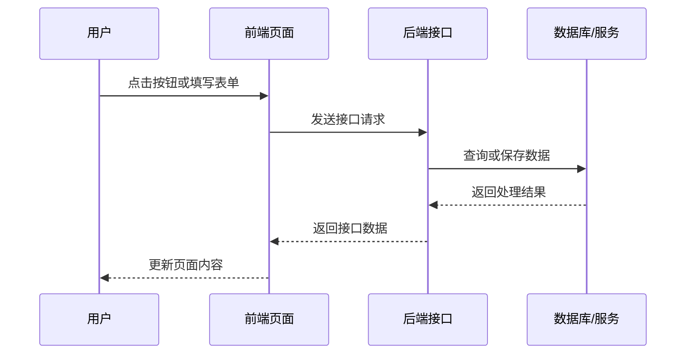
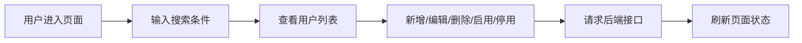
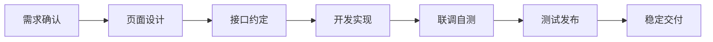
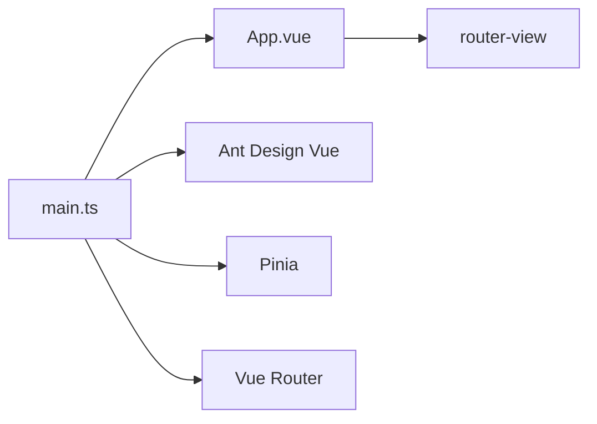
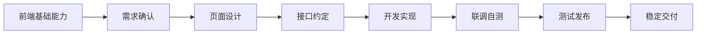

# 前端开发流程介绍：以用户列表页面为例

## 目录

| 章节 | 内容                       |
| ---- | -------------------------- |
| 1    | 前端开发负责什么           |
| 2    | 本次案例：用户列表页面     |
| 3    | 一个功能从 0 到 1 的流程   |
| 4    | 项目代码如何组织           |
| 5    | 主要前端技术说明           |
| 6    | 用户列表页面如何落地到代码 |
| 7    | 测试与质量保障             |
| 8    | 规范和 AI 协作             |
| 9    | 总结                       |

---

## 1. 前端开发负责什么

**备注**

- 开场先讲前端在系统中的位置，让非前端同事建立基本概念。
- 不需要一开始就解释 Vue、Vite、Pinia 等技术细节。
- 先讲用户能看到和操作的部分，再引出接口、状态和工程能力。

**讲稿**

前端开发主要负责浏览器中的页面展示和用户操作。用户打开系统后，首先接触到的是前端页面；用户点击按钮、填写表单、切换分页或查看图表时，也是在和前端交互。

但前端不只是“把页面画出来”。一次常见操作通常是：用户在页面上点击按钮或填写表单，前端向后端接口发送请求，后端处理完成后返回结果，前端再把结果展示到页面上。

因此，前端工作包括页面结构、交互逻辑、数据展示、接口通信、状态管理、错误处理、测试和构建发布。可以把前端理解为连接“用户操作”和“系统能力”的一层：它一边要让用户看得懂、点得动，另一边要把后端返回的数据正确展示出来，并处理加载中、提交成功、提交失败、无权限、登录过期等真实使用场景。

**介绍重点**

- 前端负责用户可见、可操作的部分。
- 前端连接用户操作和后端数据。
- 前端开发包含页面、交互、接口、状态、错误、测试和发布。

**引入方式**

可以从“用户打开一个系统后，首先接触到的就是前端页面”开始。先讲用户看到什么、点击什么、数据如何返回，再进入具体案例。

一次常见页面操作流程：



---

## 2. 本次案例：用户列表页面

**备注**

- 这里引入贯穿案例，但不要让案例取代基础介绍。
- 说明后面每一章都会回到这个页面，帮助听众把概念落到实际功能上。

**讲稿**

本次介绍会以“新增一个用户列表页面”为贯穿案例。用户列表页面是后台系统里很常见的功能，非前端同事也比较容易理解。

这个页面通常包含搜索条件、用户表格、分页、新增、编辑、删除、启用、停用等操作。它看起来像是一个普通列表，但真正开发时会涉及需求确认、页面设计、接口约定、项目目录、技术栈、联调、自测、测试和发布。

所以这个案例的作用不是替代前端基础介绍，而是帮助我们理解：前端的职责、技术和工程规范，最终是如何服务一个具体页面功能的。

**介绍重点**

- 用户列表页面是贯穿案例。
- 这个页面包含前端常见的展示、查询、操作、状态和接口能力。
- 后面讲到的流程、目录和技术，都会用这个页面举例说明。

**引入方式**

可以说：“接下来我们不只讲概念，也不只讲代码，而是用一个用户列表页面把这些内容串起来。”

用户列表页面可以简化理解为：



这个页面背后涉及的能力包括：

| 能力     | 示例                                 |
| -------- | ------------------------------------ |
| 数据展示 | 用户名、账号、角色、状态、创建时间   |
| 查询筛选 | 按姓名、账号、状态搜索               |
| 表格分页 | 当前页、每页条数、总数               |
| 用户操作 | 新增、编辑、删除、启用、停用         |
| 状态反馈 | 加载中、保存成功、删除失败、无数据   |
| 权限控制 | 没有权限时隐藏按钮或禁止操作         |
| 异常处理 | 接口失败、登录过期、无权限、数据为空 |

---

## 3. 一个功能从 0 到 1 的流程

**备注**

- 这一章讲流程主线，不展开太深技术细节。
- 重点说明前端开发不是直接写代码，而是一条从需求到交付的链路。

**讲稿**

一个前端功能从 0 到 1，通常不是从写代码开始。以前面提到的用户列表页面为例，前端首先要确认需求：页面给谁用、展示哪些字段、有哪些操作、权限怎么控制、异常情况怎么处理。

随后进入页面设计和交互确认。设计不只是正常状态下的页面长什么样，还包括加载中、空数据、错误提示、禁用状态、弹窗确认、表单校验等场景。

接着需要和后端约定接口，包括接口地址、请求参数、返回字段、分页结构、错误码和权限规则。接口约定清楚后，前端才进入页面开发，把页面、组件、路由、状态、接口函数和样式落到代码里。

页面开发完成后，还需要接口联调和自测，检查成功、失败、无权限、登录过期、空数据、边界数据等情况。最后通过测试验收和构建发布，形成一个用户可以稳定使用的页面功能。

**介绍重点**

- 前端开发是一条流程，不是单一编码动作。
- 用户列表页面从 0 到 1 包括需求、设计、接口、开发、联调、测试、发布。
- 前期确认越清楚，后期返工越少。

**引入方式**

可以从“如果只说做一个用户列表，前端其实还不知道怎么做”开始。然后按流程图逐步说明每个阶段前端要做什么。

常见流程如下：



各阶段内容：

| 阶段     | 用户列表页面中的前端工作                               |
| -------- | ------------------------------------------------------ |
| 需求确认 | 确认页面目标、展示字段、操作按钮、权限和业务规则       |
| 页面设计 | 确认布局、搜索区、表格、弹窗、空数据、加载中、错误提示 |
| 接口约定 | 确认列表、新增、编辑、删除、启用、停用等接口           |
| 开发实现 | 编写页面、组件、路由、类型、接口函数、状态和样式       |
| 联调自测 | 检查真实接口、正常流程、异常流程和边界情况             |
| 测试发布 | 通过检查、测试和构建，部署后验证页面入口和接口环境     |

---

## 4. 项目代码如何组织

**备注**

- 这一章恢复基础工程结构说明。
- 目录讲解只说明职责，不需要展开配置细节。
- 重点强调 `src/` 是业务开发的主要目录。

**讲稿**

前端项目通常按职责拆分目录。根目录主要放项目配置、构建配置、测试配置、代码生成器和文档。真正的前端源码集中在 `src/`。

以用户列表页面为例，页面文件不会随便放在项目里，而是应该放到页面目录中；接口函数放到 API 目录；类型定义放到 types 目录；复用组件放到 components 目录；共享状态放到 stores 目录；请求封装、图表等基础工具放到 utils 目录。

这样做的目的，是让不同职责的代码有固定位置。后续其他人维护用户列表页面时，可以比较快地知道页面在哪里、接口在哪里、类型在哪里、通用能力在哪里。

**介绍重点**

- 说明前端项目为什么需要目录分层。
- 说明根目录和 `src/` 的区别。
- 用用户列表页面解释各目录的职责。

**引入方式**

可以从“如果项目文件全部放在一起，后续维护会很困难”开始。然后说明本项目通过目录分层，把不同职责的代码放到固定位置。

### 4.1 根目录

```text
iframemode/
├── package.json          # 依赖和命令
├── .prettierrc           # 代码格式化
├── vite.config.ts        # 构建、开发服务、测试配置
├── tsconfig*.json        # TypeScript 配置
├── eslint.config.js      # 代码检查
├── stylelint.config.js   # 样式检查
├── e2e/                  # 端到端测试
└── src/                  # 前端源码
```

### 4.2 src 目录

```text
src/
├── components/       # 通用组件
├── hooks/            # 复用逻辑
├── router/           # 路由
├── stores/           # 全局状态
├── types/            # 类型定义
├── utils/            # 请求、图表等工具函数
├── __tests__/        # 测试配置
├── App.vue           # 应用外壳
└── main.ts           # 应用入口
```

主要分层：

| 目录          | 作用                         | 用户列表页面中的例子                      |
| ------------- | ---------------------------- | ----------------------------------------- |
| `components/` | 复用组件                     | 通用弹窗、图表、上传组件                  |
| `hooks/`      | 复用逻辑                     | 列表查询、loading、图表初始化等可复用逻辑 |
| `router/`     | 页面地址和页面组件的对应关系 | 配置用户列表页面访问地址                  |
| `stores/`     | 多个页面共享的数据           | 登录用户、权限、系统配置                  |
| `types/`      | 接口返回、分页、表单等类型   | 用户字段、查询参数、分页结果              |
| `utils/`      | 请求封装、基础工具函数       | `request.ts`、ECharts 注册                |

### 4.3 应用启动结构



启动过程可以简化理解为：`main.ts` 创建 Vue 应用，注册 Ant Design Vue、Pinia 和 Router，然后挂载 `App.vue`，最终由 `router-view` 显示当前页面。

---

## 5. 主要前端技术说明

**备注**

- 这一章恢复基础技术介绍，但用案例帮助理解。
- 不讲底层原理，采用“是什么 + 解决什么问题 + 在用户列表页面中的作用”的方式。
- 代码示例只作为讲解辅助，不需要逐行深入展开。

**讲稿**

前端项目通常不是只依赖一个技术，而是由多种工具共同完成开发、运行、构建、检查和发布。对非前端同事来说，不需要记住每个工具的全部细节，但需要理解每个技术大致解决什么问题。

本项目使用 Node.js 和 npm 支撑前端工具链，包括依赖安装、开发服务、构建、测试和代码生成。浏览器最终运行的是构建后的前端页面，不是直接运行 Node.js。

页面开发层面，本项目使用 Vue 3 组织页面和组件，使用 TypeScript 提供类型检查，使用 Vite 完成开发服务和构建发布。Ant Design Vue 提供按钮、表格、表单、弹窗等界面组件，Vue Router 管理页面地址，Pinia 管理共享状态，Axios 负责接口请求，ECharts 负责图表展示，Less 用于编写样式。

这些技术不是孤立存在的。开发用户列表页面时，Vue 负责组织页面，Ant Design Vue 提供表格和表单，Router 负责页面入口，Pinia 可以提供权限或用户信息，Axios 和 `request.ts` 请求后端接口，TypeScript 检查字段和类型，Vite 最后把项目构建成可部署的静态文件。

**介绍重点**

- 说明每个技术负责什么。
- 说明技术栈不是为了复杂而复杂，而是分别解决开发流程中的具体问题。
- 重点解释 Node.js、npm、Vue、TypeScript、Vite、Ant Design Vue、Router、Pinia、Axios、ECharts。

**引入方式**

可以从“刚才讲了流程和目录，接下来看看这些技术分别在项目里负责什么”开始。先用表格建立整体概念，再结合用户列表页面说明这些技术如何落地。

### 5.1 技术栈总览

| 技术            | 作用                                 | 用户列表页面中的理解                   |
| --------------- | ------------------------------------ | -------------------------------------- |
| Node.js         | 提供前端开发工具运行环境             | 支撑安装依赖、启动服务、构建和测试     |
| npm、pnpm、yarn | 安装依赖、执行项目命令               | 运行开发、构建、测试、代码生成命令     |
| Vue 3           | 组织页面、组件和交互                 | 编写用户列表页面和弹窗表单             |
| TypeScript      | 为代码增加类型检查                   | 检查用户字段、查询参数、接口返回结构   |
| Vite            | 启动开发服务，打包发布文件           | 本地开发预览页面，发布前构建静态文件   |
| Ant Design Vue  | 提供按钮、表格、表单、弹窗等界面组件 | 快速实现列表、搜索表单、分页和弹窗     |
| Vue Router      | 管理页面地址                         | 配置用户列表页面的访问入口             |
| Pinia           | 管理共享状态                         | 保存登录用户、权限、系统配置等共享数据 |
| Axios           | 请求后端接口                         | 查询列表、新增、编辑、删除用户         |
| ECharts         | 绘制图表                             | 如果页面需要统计图表，用于展示数据图形 |
|                 |

可以把这张表讲成三层：

- 工具层：Node.js、npm、Vite，负责让项目能安装、运行、构建。
- 页面层：Vue 3、TypeScript、Ant Design Vue、Less，负责页面结构、交互、类型和样式。
- 工程能力层：Router、Pinia、Axios、ECharts，负责页面切换、共享状态、接口请求和图表展示。

### 5.2 Node.js 和 npm

Node.js 在本项目中用于开发、构建、测试和工具执行，不用于浏览器运行页面。

| 作用         | 内容                                           |
| ------------ | ---------------------------------------------- |
| 安装依赖     | 通过 npm 安装 Vue、Vite、Ant Design Vue 等依赖 |
| 启动开发服务 | 运行 `npm run dev`，启动 Vite 开发服务         |
| 构建项目     | 运行 `npm run build`，生成静态文件             |
| 运行校验工具 | 执行 ESLint、Stylelint、Prettier、vue-tsc      |
| 运行测试工具 | 执行 Vitest、Playwright                        |

讲这部分时可以强调一句：Node.js 是开发工具的运行环境，最终给用户访问的是浏览器里的静态页面。

### 5.3 Vue 3 页面和组件

Vue 负责把页面拆成组件，并把数据变化同步到页面上。本项目统一使用 `<script setup lang="ts">`，这是 Vue 3 中比较简洁的组件写法。

一个最小的组件可以这样理解：

```vue
<template>
  <a-button @click="increment">点击 {{ count }}</a-button>
</template>

<script setup lang="ts">
import { ref } from 'vue'

const count = ref(0)

function increment() {
  count.value++
}
</script>
```

讲解时不用深入响应式原理，只需要说明：`template` 是页面结构，`script setup` 是组件逻辑，`ref` 定义会影响页面显示的数据，`@click` 表示点击按钮时执行方法。

### 5.4 TypeScript

TypeScript 的作用是给 JavaScript 增加类型检查。对用户列表页面来说，它可以帮助前端确认用户字段、查询参数、分页结果和接口返回结构是否一致。

例如用户数据可以这样理解：

```ts
type TUser = {
  id: number
  name: string
  account: string
  status: 'enabled' | 'disabled'
}
```

这样写的好处是：如果页面里把 `name` 写错成不存在的字段，或者把状态值传错，类型检查可以更早发现问题。

### 5.5 Router、Pinia、Axios 和 ECharts

Vue Router 负责“地址和页面”的对应关系。用户访问不同地址时，Router 决定应该显示哪个页面组件。用户列表页面如果是一个独立页面，就需要在路由中配置访问入口。

Pinia 用来保存多个页面或多个组件都需要使用的数据。不是所有数据都要放进 Pinia，只有跨页面共享、登录信息、系统配置、权限信息等数据才适合放到 store 里。

Axios 用于请求后端接口。本项目不会建议页面到处直接写 `axios.get('/xxx')`，而是通过 `src/api/` 里的请求函数，再调用统一的 `request.ts` 请求封装。这样 token、错误提示、登录过期和无权限处理都能集中维护。

ECharts 用于图表展示。用户列表页面本身不一定需要图表，但如果后续要展示用户增长趋势、角色分布等统计信息，就可以使用项目里的图表封装能力。

---

## 6. 用户列表页面如何落地到代码

**备注**

- 这一章把前面的流程、目录和技术合起来。
- 要给出页面内容、通用组件、路由配置、接口函数和页面状态的例子。
- 示例代码只用于帮助理解结构，不需要讲成完整代码教程。

**讲稿**

当需求、设计和接口都确认后，用户列表页面才真正进入代码实现。这个阶段不是把所有代码写在一个文件里，而是按项目结构把不同职责放到对应位置。

页面主体负责组织搜索区、表格、分页和操作按钮；接口文件负责声明查询、新增、编辑、删除等接口函数；类型文件负责定义用户字段、查询参数和分页结果；通用组件负责复用弹窗、表格、图表等能力；请求封装负责统一处理 token、错误、401 和 403；路由负责让用户能访问到这个页面。

如果用一句话概括：用户列表页面是一个业务页面，它会组合项目里的路由、页面组件、通用组件、接口函数、类型定义、请求封装和状态管理能力。

**介绍重点**

- 把用户列表页面拆成页面、接口、类型、组件、状态、路由、请求封装。
- 用示例说明页面内容、通用组件和路由配置如何落地。
- 强调页面开发是把需求、设计和接口落到工程结构中。

**引入方式**

可以从“现在我们把用户列表页面真正放进项目里”开始。然后按文件职责讲落地方式：先看文件放哪里，再看页面由哪些部分组成，最后看路由和接口如何把页面串起来。

### 6.1 文件对应关系

| 内容              | 可能位置                            | 作用                                       |
| ----------------- | ----------------------------------- | ------------------------------------------ |
| 用户列表页面      | `src/views/system/user/index.vue`   | 页面主体，组织搜索、表格、分页和操作       |
| 页面局部组件      | `src/views/system/user/components/` | 用户表单弹窗、搜索表单等页面内组件         |
| 用户接口函数      | `src/api/system/user.ts`            | 查询、新增、编辑、删除、启用、停用         |
| 用户类型定义      | `src/types/system/user.ts`          | 定义用户字段、查询参数、表单数据           |
| 通用弹窗/表格组件 | `src/components/`                   | 复用项目已有界面能力                       |
| 共享状态          | `src/stores/`                       | 保存跨页面共享的数据，如登录用户、权限信息 |
| 请求封装          | `src/utils/request.ts`              | 统一处理 token、错误、401、403             |
| 路由配置          | `src/router/`                       | 配置页面访问地址                           |

可以这样讲：`views` 负责“这个页面长什么样、怎么交互”，`api` 负责“这个页面怎么和后端说话”，`types` 负责“字段和数据结构是什么”，`components` 负责“哪些界面能力可以复用”，`router` 负责“用户怎么进入这个页面”。

### 6.2 路由配置示例

页面要想访问需要配置对应的路由          。这个工作由 Vue Router 负责。路由配置可以简化理解为：

```ts
{
  path: '/system/user',
  name: 'SystemUser',
  component: () => import('@/views/system/user/index.vue'),
  meta: {
    title: '用户管理',
  },
}
```

讲解时只需要说明：

- `path` 是页面访问地址。
- `name` 是路由名称，方便代码里识别这个页面。
- `component` 指向用户列表页面文件。
- `meta.title` 可以用于菜单、标签页或页面标题展示。

也就是说，页面文件只是“页面本身”，路由配置才决定“用户通过哪个地址进入这个页面”。

### 6.3 页面内容和组件示例

用户列表页面的主体通常会包含搜索区、操作区、表格区和弹窗区。结构可以简化理解为：

```vue
<template>
  <section class="user-page">
    <a-form layout="inline">
      <a-form-item label="账号">
        <a-input v-model:value="query.account" placeholder="请输入账号" />
      </a-form-item>
      <a-form-item label="状态">
        <a-select v-model:value="query.status" allow-clear />
      </a-form-item>
      <a-button type="primary" @click="loadUsers">查询</a-button>
      <a-button @click="resetQuery">重置</a-button>
    </a-form>

    <a-button type="primary" @click="openCreate">新增用户</a-button>

    <a-table
      row-key="id"
      :columns="columns"
      :data-source="users"
      :loading="loading"
      :pagination="pagination"
      @change="handleTableChange"
    />

    <UserFormModal ref="formModalRef" @success="loadUsers" />
  </section>
</template>
```

这段示例不需要逐行讲，只需要说明页面由几个区域组成：

- 搜索区：收集账号、状态等查询条件。
- 操作区：提供新增用户等按钮。
- 表格区：展示用户数据、loading 和分页。
- 弹窗区：新增或编辑用户成功后，通知页面刷新列表。

用户列表页面里，有些内容只属于这个页面，比如“用户新增/编辑表单弹窗”，可以放在页面自己的 `components/` 目录中；有些能力很多页面都会用，比如基础弹窗、图表、上传组件，可以放在全局 `src/components/` 中。

一个用户表单弹窗可以这样理解：

```vue
<template>
  <ModalDialog ref="modalRef" title="用户信息" @ok="submitForm">
    <a-form :model="formState">
      <a-form-item label="账号" name="account">
        <a-input v-model:value="formState.account" />
      </a-form-item>
      <a-form-item label="姓名" name="name">
        <a-input v-model:value="formState.name" />
      </a-form-item>
    </a-form>
  </ModalDialog>
</template>
```

这里可以说明两层复用关系：

- `UserFormModal` 是用户页面自己的业务组件，负责用户新增和编辑。
- `ModalDialog` 是项目通用弹窗组件，负责统一弹窗打开、关闭、确认等行为。

这样拆分后，页面主体不用塞满表单细节，通用弹窗也不用知道“用户”这个业务是什么。

### 6.4 接口函数和类型示例

一个列表接口可以这样理解：

```ts
import request from '@/utils/request'
import type { TApiResponse, TPageResult } from '@/types/common'
import type { TUser, TUserListParams } from '@/types/system/user'

export function fetchUserList(params: TUserListParams) {
  return request.get<TApiResponse<TPageResult<TUser>>>('/system/users', {
    params,
  })
}
```

对应的类型可以这样理解：

```ts
type TUser = {
  id: number
  account: string
  name: string
  status: 'enabled' | 'disabled'
}

type TUserListParams = {
  account?: string
  status?: string
  pageNum: number
  pageSize: number
}
```

这两段代码说明：

- 接口函数负责表达“如何请求用户列表”。
- 类型定义负责表达“请求参数和返回数据长什么样”。
- `request` 负责统一处理接口前缀、token、错误、登录过期和无权限。

### 6.5 页面状态和数据刷新示例

用户列表页面通常会记录这些状态：

```ts
const loading = ref(false)
const users = ref<TUser[]>([])
const query = reactive<TUserListParams>({ pageNum: 1, pageSize: 10 })
const total = ref(0)
```

查询列表时，页面会先进入 loading 状态，请求接口，拿到结果后更新表格和分页：

```ts
async function loadUsers() {
  loading.value = true
  try {
    const res = await fetchUserList(query)
    users.value = res.data.records
    total.value = res.data.total
  } finally {
    loading.value = false
  }
}
```

这段代码只需要理解为：用户点击搜索、翻页、新增、编辑、删除时，页面会重新请求接口，并把最新数据显示到表格中。前端开发的核心工作之一，就是让页面状态、用户操作和接口数据保持一致。

---

## 7. 测试与质量保障

**备注**

- 恢复基础测试和质量保障说明。
- 重点区分代码检查、单元测试、组件测试、端到端测试。
- 不要把当前测试讲成完整业务覆盖，目前模板只覆盖基础能力。

**讲稿**

前端质量保障包括类型检查、代码检查和自动化测试。TypeScript 用于检查字段和类型，ESLint、Stylelint 和 Prettier 用于保证代码和样式规范。

自动化测试分为单元测试、组件测试和端到端测试。Vitest 用于运行单元测试和组件测试，`@vue/test-utils` 用于挂载 Vue 组件并检查组件行为，Playwright 用于打开真实浏览器执行端到端测试。

对于用户列表页面来说，页面写完后不能只看页面能不能打开，还要检查搜索、分页、新增、编辑、删除、接口失败、空数据、无权限、登录过期等情况。当前项目已有基础测试示例，由于模板还没有具体业务页面，端到端测试暂时只覆盖应用启动和基础布局显示。后续有业务页面后，应继续补充业务流程测试。

**介绍重点**

- 质量保障不只依赖人工测试。
- 区分类型检查、代码检查、单元测试、组件测试、端到端测试。
- 用用户列表页面说明业务测试应该覆盖哪些场景。

**引入方式**

可以从“代码写完以后，不能只看页面能不能打开，还需要通过多层检查”开始。先介绍工具，再说明用户列表页面要测试哪些场景。

### 7.1 校验和测试技术

| 技术                 | 作用                         |
| -------------------- | ---------------------------- |
| TypeScript / vue-tsc | 检查字段、类型、组件参数     |
| ESLint               | 检查代码写法                 |
| Stylelint            | 检查样式写法                 |
| Prettier             | 统一代码格式                 |
| Vitest               | 运行单元测试和组件测试       |
|                      |
|                      |
| Playwright           | 使用真实浏览器执行端到端测试 |

### 7.2 测试分层

| 层级       | 检查内容                     |
| ---------- | ---------------------------- |
| 类型检查   | 数据字段和类型是否正确       |
| 代码检查   | 代码写法和样式是否符合规范   |
| 单元测试   | 单个函数或逻辑是否正确       |
| 组件测试   | 单个组件显示和事件是否正确   |
| 端到端测试 | 页面是否能在浏览器中正常运行 |

### 7.3 用户列表页面自测清单

| 场景     | 检查内容                                       |
| -------- | ---------------------------------------------- |
| 页面加载 | 首次进入是否自动查询，loading 是否正常         |
| 搜索     | 输入条件后是否按条件查询，重置是否恢复默认条件 |
| 分页     | 切换页码和每页条数是否正确请求                 |
| 新增     | 表单校验、保存成功、保存失败、保存后刷新       |
| 编辑     | 数据回填、保存更新、取消关闭                   |
| 删除     | 二次确认、删除成功刷新、删除失败提示           |
| 空数据   | 页面是否显示空状态，而不是报错或空白           |
| 接口失败 | 是否有错误提示，页面是否还能继续操作           |
| 无权限   | 按钮是否隐藏、禁用或提示无权限                 |
| 登录过期 | 是否触发统一登录过期处理                       |

### 7.4 当前项目已有测试

| 文件                                           | 内容                                 |
| ---------------------------------------------- | ------------------------------------ |
| `src/components/__tests__/BasicChart.test.ts`  | 检查图表 loading、配置更新、点击事件 |
| `src/components/__tests__/ModalDialog.test.ts` | 检查弹窗显示、标题、确认事件         |
| `e2e/app.spec.ts`                              | 检查应用能否挂载并显示 `.app-layout` |

---

## 8. 规范和 AI 协作

**备注**

- 强调 AI 应遵守工程规范，而不是绕过工程规范。
- 不需要展开每个 SOP 文件内容，只说明入口和协作方式。

**讲稿**

本项目除了代码结构，也包含规范体系。`.claude/sop/` 用于记录命名、代码约束、组件设计、状态管理、API 设计和技术栈规则。`AGENTS.md` 和 `CLAUDE.md` 用于给 AI 工具提供项目级指导。

当项目由多人或 AI 一起参与时，需要统一规则。否则同样是开发用户列表页面，不同人可能会把接口放在不同位置，类型命名不一致，组件拆分方式不一致，错误处理方式也不一致。短期看能跑，长期看会增加维护成本。

推荐的协作方式是先按规范确定目录、命名、接口和组件拆分，再使用 Plop 生成标准文件，之后补充业务代码，并通过类型检查、代码检查和测试验证结果。AI 可以辅助生成页面骨架、接口类型、通用组件和测试用例，但不能绕过项目规范，也不能替代最终的联调、自测和验收。重复出现的问题应沉淀到 SOP 文档中。

**介绍重点**

- 规范的作用是降低多人协作和长期维护成本。
- AI 可以参与开发，但需要遵守项目结构和规则。
- SOP、AGENTS.md、CLAUDE.md 是项目级协作入口。

**引入方式**

可以从“如果每个人都按自己的习惯写用户列表页面，项目很快就会变乱”开始。然后说明规范和 AI 协作的意义。

主要入口：

| 文件                    | 作用                                     |
| ----------------------- | ---------------------------------------- |
| `.claude/sop/README.md` | 规范索引                                 |
| `.claude/sop/通用/`     | 通用工程规范                             |
| `.claude/sop/技术栈/`   | Vue、Ant Design Vue、Pinia、ECharts 规范 |
| `AGENTS.md`             | Codex 项目指导                           |
| `CLAUDE.md`             | Claude Code 入口                         |
| `CONTEXT.md`            | 术语定义                                 |

以用户列表页面为例，规范和 AI 协作可以这样落地：

1. 先按规范确认页面目录、接口文件、类型文件和组件拆分。
2. 使用 Plop 生成标准页面、组件或接口骨架。
3. AI 辅助补充页面逻辑、接口类型、表单校验和测试用例。
4. 人工检查业务规则、交互细节和接口联调结果。
5. 使用类型检查、代码检查和测试验证结果。
6. 将重复出现的问题沉淀到 SOP 文档。

---

## 9. 总结

**备注**

- 收尾回到“基础概念 + 案例主线 + 工程能力”。
- 强调用户列表页面只是例子，其他前端功能也可以套用类似流程。

**讲稿**

本次介绍先说明了前端开发负责什么，再以用户列表页面为例，串起了一个前端功能从 0 到 1 的完整流程。前端开发不是从写代码开始，也不是页面能打开就结束，而是从需求确认开始，经过页面设计、接口约定、开发实现、联调自测、测试发布，最后形成一个用户可以稳定使用的页面功能。

同时，前端开发也离不开基础工程能力。项目目录分层让代码有固定位置，Vue、TypeScript、Vite、Ant Design Vue、Router、Pinia、Axios、ECharts 等技术分别解决页面组织、类型检查、构建发布、界面组件、页面路由、共享状态、接口请求和图表展示等问题。

`iframeMode-template` 展示的是这套流程中的基础工程能力，包括目录分层、请求封装、通用组件、图表封装、代码生成、自动校验、自动化测试和规范文档。它的作用是减少重复工作，统一开发方式，并让后续业务页面开发可以站在一个稳定的基础上继续推进。

**介绍重点**

- 回顾前端负责什么。
- 回顾用户列表页面从 0 到 1 的流程。
- 回顾项目目录、技术栈、质量保障和规范协作的作用。

**引入方式**

可以从“最后我们回到最开始的问题：前端是不是只负责把页面画出来？”开始。答案是：不是。前端要把需求、设计、接口和工程能力整合起来，交付一个用户真正可用、可维护、可验证的页面功能。

完整流程可以概括为：



一句话总结：用户列表页面是案例，前端开发流程和工程能力才是重点。
