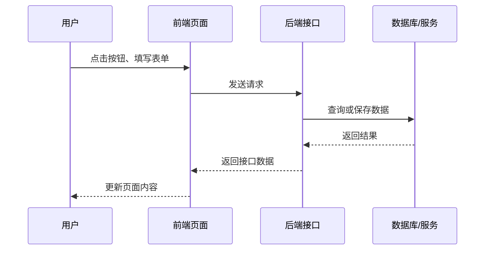
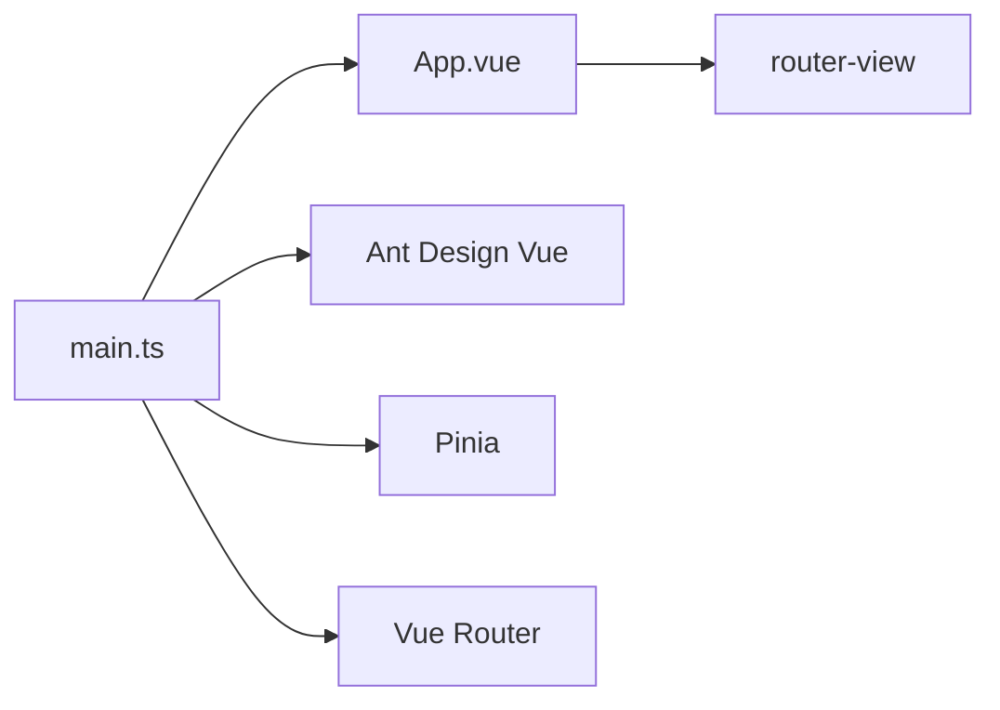
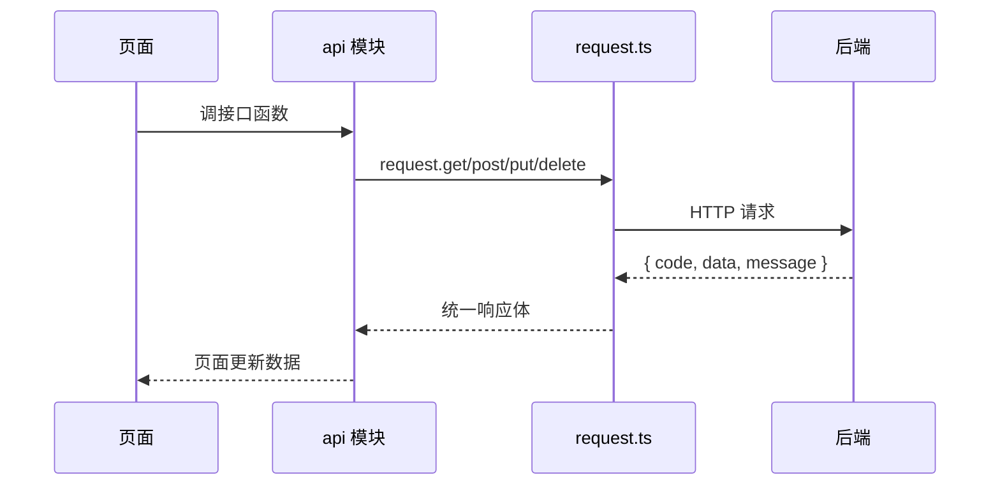

# iframeMode-template 技术文档

## 1. 项目概述

`iframeMode-template` 是一个 Vue 3 企业级前端模板。

当前项目是模板基座，不是完整业务系统：

- 路由表 `src/router/router.config.ts` 目前为空。
- 当前没有 `src/views/` 业务页面。
- 业务页面通过 Plop 模板生成。
- 生产环境隐藏侧边菜单，适合 iframe 嵌入。
- 基础能力已内置：请求封装、图表封装、通用组件、工程校验、测试配置、SOP 规范。

## 2. 前端项目说明

前端项目负责用户在浏览器里看到和操作的部分。

一次常见操作链路：



本项目中各部分对应关系：

| 名称 | 说明 |
| --- | --- |
| Vue | 组织页面和交互 |
| Ant Design Vue | 提供按钮、表格、弹窗等现成界面组件 |
| Vue Router | 管理不同页面地址 |
| Pinia | 保存多个页面都要用的数据 |
| Axios | 向后端接口发送请求 |
| ECharts | 画图表 |
| Vite | 将源码打包成浏览器可运行的文件 |
| iframe | 让这个前端页面嵌入到另一个系统里 |

## 3. 传统前端开发流程

一套常见的前端开发流程：


各阶段做什么：

| 阶段 | 前端主要工作 |
| --- | --- |
| 需求确认 | 明确页面有哪些功能、按钮、表单、列表、弹窗 |
| 页面设计 | 确认页面布局、交互方式、展示字段 |
| 接口约定 | 和后端确认接口地址、请求参数、返回数据 |
| 页面开发 | 写页面、组件、路由、状态、样式 |
| 接口联调 | 页面调用后端接口，处理成功、失败、登录过期 |
| 自测和测试 | 检查页面展示、交互、异常情况 |
| 构建发布 | 打包成静态文件，交给部署环境 |

这个模板对应流程里的基础部分：

| 流程环节 | 本项目提供的内容 |
| --- | --- |
| 页面开发 | `src/components/`、`src/hooks/`、`src/router/`、`src/stores/` |
| 接口联调 | `src/utils/request.ts`、`src/types/common.ts` |
| 图表开发 | `src/utils/echarts.ts`、`src/hooks/useChart.ts`、`BasicChart.vue` |
| 代码生成 | `plopfile.js`、`templates/` |
| 自测和测试 | Vitest、Playwright |
| 代码校验 | ESLint、Stylelint、Prettier、Husky |
| 规范沉淀 | `.claude/sop/`、`AGENTS.md` |

## 4. 技术栈

| 类型 | 技术 |
| --- | --- |
| 运行环境 | Node.js |
| 包管理 | npm |
| 框架 | Vue 3 |
| 语言 | TypeScript |
| 构建 | Vite |
| UI | Ant Design Vue |
| 路由 | Vue Router Hash 模式 |
| 状态 | Pinia |
| 请求 | Axios |
| 图表 | ECharts |
| 样式 | Less |
| 单元测试 | Vitest + @vue/test-utils |
| E2E | Playwright |
| 代码规范 | ESLint + Stylelint + Prettier |
| 提交校验 | Husky + lint-staged + commitlint |
| 代码生成 | Plop |

Node.js 在本项目中用于前端开发工具链，不用于浏览器运行页面。

| 作用 | 内容 |
| --- | --- |
| 安装依赖 | 通过 npm 安装 Vue、Vite、Ant Design Vue 等依赖 |
| 启动开发服务 | 运行 `npm run dev`，启动 Vite 开发服务 |
| 构建项目 | 运行 `npm run build`，生成浏览器可运行的静态文件 |
| 运行校验工具 | 执行 ESLint、Stylelint、Prettier、vue-tsc |
| 运行测试工具 | 执行 Vitest、Playwright |
| 执行代码生成 | 运行 Plop 生成页面、组件、API 文件 |

## 5. 目录结构

```text
src/
├── components/       # 通用组件
├── hooks/            # 组合式逻辑
├── router/           # 路由实例和路由表
├── stores/           # Pinia store
├── types/            # 全局类型
├── utils/            # 请求、图表等工具
├── __tests__/        # 测试 setup
├── App.vue           # 应用外壳
└── main.ts           # 应用入口
```

```text
templates/
├── api/              # API 和类型模板
├── component/        # 通用组件模板
└── page/             # 页面模板
```

```text
.claude/sop/          # 开发规范
e2e/                  # Playwright 用例
docs/                 # 文档
```

## 6. 启动结构



相关文件：

| 文件 | 内容 |
| --- | --- |
| `src/main.ts` | 创建 Vue 应用，注册 Ant Design Vue、Pinia、Router |
| `src/App.vue` | 应用布局、中文 locale、开发态菜单、内容区 |
| `src/router/index.ts` | 创建 Hash Router |
| `src/router/router.config.ts` | 路由表 |

## 7. iframe 模式

当前实现：

| 点 | 代码位置 |
| --- | --- |
| 开发环境显示侧边菜单 | `src/App.vue` |
| 生产环境隐藏侧边菜单 | `src/App.vue` 的 `import.meta.env.PROD` |
| 内容通过 `router-view` 渲染 | `src/App.vue` |
| Hash 路由 | `src/router/index.ts` |
| 相对路径打包 | `vite.config.ts` 的 `base: './'` |

## 8. 请求封装

文件：`src/utils/request.ts`

请求层能力：

| 能力 | 实现 |
| --- | --- |
| baseURL | `import.meta.env.VITE_BASE_URL` |
| 超时 | `15000ms` |
| Cookie | `withCredentials: true` |
| Token | 从 `localStorage.token` 读取，写入 `Authorization` |
| 业务错误 | `code !== 200` 时 reject `ApiError` |
| 401 | 清 token，跳转 `#/login` |
| 403 | 提示无权限 |
| 方法 | `get`、`post`、`put`、`delete` |

统一响应类型：`src/types/common.ts`

```ts
type TApiResponse<T = unknown> = {
  code: number
  data: T
  message: string
}
```

请求链路：



## 9. 图表封装

相关文件：

| 文件 | 职责 |
| --- | --- |
| `src/utils/echarts.ts` | ECharts 按需注册 |
| `src/hooks/useChart.ts` | 图表生命周期 |
| `src/components/BasicChart.vue` | 图表组件 |
| `src/types/echarts.ts` | 图表 option 类型 |

`useChart` 处理：

- 初始化 ECharts 实例。
- option 变化后更新图表。
- window resize 后调整图表尺寸。
- 组件卸载时销毁实例。
- 图表渲染完成后触发 `finished`。
- grid 区域点击后触发 `axisClick`。

## 10. 通用组件

| 组件 | 作用 |
| --- | --- |
| `BasicChart.vue` | ECharts 图表组件 |
| `BasicUpload.vue` | 上传组件，输出 `FormData` |
| `ModalDialog.vue` | 弹窗组件，暴露 `show`、`close`、`toggle` |
| `DrawerDialog.vue` | 抽屉组件，暴露 `show`、`close`、`toggle` |
| `TreeWrapper.vue` | 左树右内容布局 |

组件约定：

- 使用 `<script setup lang="ts">`。
- Props、Emits 写类型。
- 通用组件不直接调用业务 API。
- 页面私有组件放页面目录下的 `components/`。

## 11. 状态管理

文件：`src/stores/counter.ts`

当前是 Pinia 示例 store：

- `ref` 定义状态。
- `computed` 定义派生值。
- 函数定义 action。
- `defineStore('counter', () => {})` 使用 Composition API 写法。

状态边界：

| 状态类型 | 放置位置 |
| --- | --- |
| 跨页面共享 | `stores/` |
| 页面临时状态 | 页面组件或页面 hook |
| 通用组件内部状态 | 组件内部 |

## 12. 路由

文件：

| 文件 | 内容 |
| --- | --- |
| `src/router/index.ts` | Router 实例 |
| `src/router/router.config.ts` | 路由表 |

当前路由表：

```ts
export const routes: RouteRecordRaw[] = []
```

新增页面后，需要在 `router.config.ts` 中添加路由记录。

## 13. 代码生成

Plop 生成器：`plopfile.js`

| 生成器 | 输出 |
| --- | --- |
| `api` | `src/api/<name>.ts`、`src/types/<name>.ts` |
| `page` | `src/views/<camelCaseName>/index.vue`、页面组件目录 |
| `component` | `src/components/<PascalCaseName>.vue` |

`api` 生成器会自动向 `src/types/index.ts` 追加类型导出。

## 14. 工程配置

### 14.1 Vite

文件：`vite.config.ts`

| 配置 | 内容 |
| --- | --- |
| `base` | `./` |
| alias | `@` 指向 `src` |
| proxy | `/api` 转发到 `http://localhost:8080` |
| plugins | Vue、Vue JSX、Vue DevTools |
| test | Vitest 配置 |

### 14.2 TypeScript

| 文件 | 作用 |
| --- | --- |
| `tsconfig.json` | 项目引用入口 |
| `tsconfig.app.json` | 应用代码 |
| `tsconfig.node.json` | Node 侧配置文件 |
| `tsconfig.vitest.json` | 测试代码 |

### 14.3 校验工具

| 工具 | 作用 |
| --- | --- |
| ESLint | JS/TS/Vue 检查 |
| Stylelint | CSS/Less/Vue 样式检查 |
| Prettier | 格式化 |
| commitlint | 提交信息检查 |
| Husky | Git hooks |
| lint-staged | 只处理暂存文件 |

## 15. 测试

### 15.1 测试技术

| 技术 | 作用 | 说明 |
| --- | --- | --- |
| TypeScript / vue-tsc | 类型检查 | 检查字段名、字段类型、组件参数是否对得上 |
| ESLint | 代码规范检查 | 检查未使用变量、调试代码、不规范写法 |
| Stylelint | 样式规范检查 | 检查 CSS、Less、Vue 样式写法 |
| Prettier | 格式化 | 统一缩进、引号、换行 |
| Vitest | 单元测试运行器 | 跑函数和组件的小范围测试 |
| @vue/test-utils | Vue 组件测试工具 | 挂载组件，检查组件渲染和事件 |
| happy-dom | 测试用浏览器环境 | 在 Node 环境中模拟 DOM |
| Playwright | 端到端测试 | 打开真实浏览器，验证页面流程 |

测试分层：

| 层级 | 测什么 | 当前项目 |
| --- | --- | --- |
| 类型检查 | 数据和组件参数是否符合类型 | `vue-tsc` |
| 代码检查 | 写法、格式、样式是否符合规范 | ESLint、Stylelint、Prettier |
| 单元测试 | 单个函数或逻辑是否正确 | Vitest |
| 组件测试 | 组件能否显示、响应 props、触发事件 | Vitest + @vue/test-utils |
| 端到端测试 | 应用能否在浏览器里按用户流程运行 | Playwright |

### 15.2 当前单元和组件测试

| 文件 | 覆盖内容 |
| --- | --- |
| `src/components/__tests__/BasicChart.test.ts` | 图表 loading、option 更新、点击事件 |
| `src/components/__tests__/BasicUpload.test.ts` | 上传 MIME 通配符与扩展名匹配 |
| `src/components/__tests__/ModalDialog.test.ts` | 弹窗显示、标题、确认事件 |

测试环境：

- Vitest
- happy-dom
- @vue/test-utils
- `src/__tests__/setup.ts` 按需注册组件测试所需的 Ant Design Vue 子组件，避免未解析组件 warning

### 15.3 当前 E2E 测试

| 文件 | 覆盖内容 |
| --- | --- |
| `e2e/app.spec.ts` | 应用挂载，`.app-layout` 可见 |

Playwright 配置：

- 使用 `127.0.0.1:5180` 作为项目专用测试服务，不复用已有开发服务。
- 自动启动开发服务。
- Chromium 浏览器。
- 失败截图。
- 首次重试记录 trace。

## 16. SOP 和 Agent 入口

| 文件 | 作用 |
| --- | --- |
| `.claude/sop/README.md` | 规范入口 |
| `.claude/sop/通用/` | 通用工程规范 |
| `.claude/sop/技术栈/` | Vue、Ant Design Vue、Pinia、ECharts 规范 |
| `AGENTS.md` | Codex 项目指导 |
| `CLAUDE.md` | Claude Code 入口 |
| `CONTEXT.md` | 术语定义 |

## 17. PPT 结构建议

| 页码 | 主题 |
| --- | --- |
| 1 | 项目是什么 |
| 2 | 前端项目如何工作 |
| 3 | 传统前端开发流程 |
| 4 | 技术栈 |
| 5 | 目录分层 |
| 6 | 启动结构和 iframe 模式 |
| 7 | 请求封装 |
| 8 | 图表封装 |
| 9 | 通用组件 |
| 10 | 工程校验、测试、SOP |

## 18. 当前不足

| 问题 | 影响 |
| --- | --- |
| 没有真实业务页面 | PPT 演示缺少页面案例 |
| 路由表为空 | 不能展示页面切换 |
| `request.ts` 缺少测试 | 请求契约没有自动化保障 |
| `BasicUpload` 能力较基础 | 缺少大小限制、多文件等配置 |
| E2E 覆盖较少 | 只验证应用挂载 |
