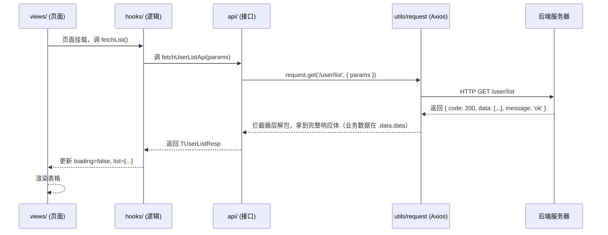
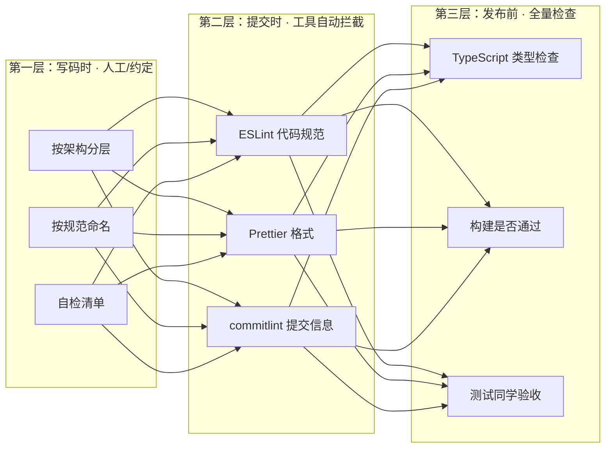

# 前端项目模板技术文档

> **文档定位**：本模板（iframeMode-template）的完整技术说明，面向使用该模板的开发者、接手项目的团队成员、以及需要了解前端工程化体系的读者。
>
> **配套分享**：如需面向非前端听众的科普分享稿，见同目录《前端开发分享演讲稿.md》。

---

## 1. 项目简介

### 1.1 项目定位

一个 **Vue 3 + TypeScript + Ant Design Vue** 的企业级前端项目模板，解决"从 0 到 1 搭项目"的重复劳动问题。开箱即用地提供：

- **标准化的目录架构**：`src/` 八层分层，职责边界清晰，数据流向固定
- **完整的工程化配置**：ESLint / Prettier / Husky / lint-staged / commitlint 开箱即用
- **代码生成脚手架**：一条命令生成符合规范的 API 模块 / 页面 / 组件骨架
- **SOP 规范体系**：`.claude/sop/` 沉淀团队规范，让 AI 也能按统一标准产出代码

### 1.2 技术栈

| 类别       | 技术                                        | 版本     |
| ---------- | ------------------------------------------- | -------- |
| 框架       | Vue 3（Composition API + `<script setup>`） | ^3.3.11  |
| 语言       | TypeScript（strict 模式）                   | ~5.3.0   |
| 构建       | Vite                                        | ^5.0.10  |
| UI 库      | Ant Design Vue                              | ^4.2.2   |
| 图标       | @ant-design/icons-vue                       | ^7.0.1   |
| 状态管理   | Pinia（Composition API 风格）               | ^2.1.7   |
| 路由       | Vue Router（Hash 模式）                     | ^4.2.5   |
| 网络请求   | Axios（统一封装）                           | ^1.6.5   |
| 图表       | ECharts（按需注册）                         | ^5.5.1   |
| 样式       | Less（scoped）                              | ^4.2.0   |
| 日期       | dayjs                                       | ^1.11.10 |

### 1.3 环境要求

- Node.js **>= 18.0.0**
- 包管理器：npm（模板脚本基于 npm 编写）

---

## 2. 快速开始

### 2.1 常用命令

| 命令                                | 用途                                                       |
| ----------------------------------- | ---------------------------------------------------------- |
| `npm run dev`                       | 启动开发服务器（默认 http://localhost:5173）               |
| `npm run build`                     | 类型检查 + 构建（`vue-tsc --build --force && vite build`） |
| `npm run preview`                   | 本地预览构建产物                                           |
| `npm run type-check`                | TypeScript 类型检查                                        |
| `npm run lint`                      | ESLint 检查并自动修复                                      |
| `npm run lint:check`                | ESLint + Stylelint 只检查，不修改                          |
| `npm run format`                    | Prettier 格式化 `src/` 下文件                              |
| `npm run format:check`              | Prettier 格式检查，不修改                                  |
| `npm run gen:api -- <模块名>`       | 生成 API 模块（`api/xxx.ts` + `types/xxx.ts`）             |
| `npm run gen:page -- <页面名>`      | 生成页面骨架（`views/xxx/` + components）              |
| `npm run gen:component -- <组件名>` | 生成通用组件（`components/Xxx.vue`）                       |

### 2.2 目录速览

```
iframemode/
├── src/                  # ★ 业务代码（主要开发目录）
├── templates/            # 脚手架模板（plop 生成代码的源头）
├── .claude/              # SOP 规范体系 + 根目录 CLAUDE.md 导入桥
├── package.json          # 项目说明书、依赖、命令和 lint-staged 配置
├── vite.config.ts        # 构建/开发服务器配置
├── tsconfig*.json        # TypeScript 配置（app + node 两套）
├── eslint.config.js      # 代码规范检查
├── .prettierrc           # 代码格式化
├── commitlint.config.js  # 提交信息规范
├── .husky/               # Git 钩子
└── plopfile.js           # 代码生成器入口
```

---

## 3. 目录架构详解

### 3.1 根目录：工程化配置层

| 文件 / 目录             | 作用                                                            | 类比       |
| ----------------------- | --------------------------------------------------------------- | ---------- |
| `package.json`          | 项目说明书、依赖、命令和 lint-staged 配置                     | 工程入口   |
| `vite.config.ts`        | 构建/开发服务器配置、别名 `@`、代理                             | 工厂流水线 |
| `tsconfig.json`         | TS 项目引用入口（app + node 两套）                              | 总控台     |
| `tsconfig.app.json`     | 应用代码 TS 配置（strict、`@/*` 路径）                          | —          |
| `tsconfig.node.json`    | 工程脚本 TS 配置                                                | —          |
| `eslint.config.js`      | 代码规范检查（含 import 自动排序）                              | 纠察员     |
| `.prettierrc`           | 代码格式化（缩进/引号/分号）                                    | 排版员     |
| `commitlint.config.js`  | Git 提交信息规范（type 枚举）                                   | 门卫之一   |
| `.husky/`               | Git 钩子（pre-commit 跑 lint-staged，commit-msg 跑 commitlint） | 门卫       |
| `plopfile.js`           | 代码生成脚手架入口                                              | 预制件工厂 |
| `templates/`            | 脚手架模板文件（.hbs）                                          | 模具       |
| `.claude/`              | SOP 规范体系 + 根目录 CLAUDE.md 导入桥                         | 规则手册   |
| `src/`                  | ★ 业务代码主目录                                                | 生产车间   |

### 3.2 src/ 八层架构

```
src/
├── api/         # 接口调用层：所有后端请求函数（fetchUserListApi 等）
├── components/  # 通用组件：跨模块可复用的 UI 积木（BasicTable 等）
├── hooks/       # 组合式函数：可复用逻辑（useEcharts、useTrendOpt）
├── router/      # 路由：index.ts 创建实例 + router.config.ts 路由表
├── stores/      # 全局状态：跨页面共享数据（Pinia store）
├── types/       # 类型定义：与后端数据结构的契约
├── utils/       # 工具函数：纯函数小工具（request.ts / echarts.ts）
└── views/       # 页面组件：一个路由对应一个文件夹
```

**分层职责：**

| 层            | 职责                           | 放什么 / 不放什么                                        |
| ------------- | ------------------------------ | -------------------------------------------------------- |
| `views/`      | 页面入口，负责数据流编排与布局 | 放：页面组件、页面级 hooks、页面私有组件；不放：通用逻辑 |
| `components/` | 跨模块可复用的 UI 组件         | 放：通用组件（不持有业务状态）；不放：只在本页用的 UI    |
| `hooks/`      | 可复用的组合式函数             | 放：useLoading、useEcharts、useTrendOpt 等               |
| `api/`        | 与后端通信的唯一入口           | 放：按模块聚合的接口函数；**组件内禁止直接 fetch/axios** |
| `types/`      | 类型集中管理                   | 放：模块类型（TUserInfo 等）；不放：散落在各文件         |
| `stores/`     | 全局共享状态                   | 放：登录态/配置/跨页缓存；不放：弹窗开关/表单临时值      |
| `utils/`      | 纯函数工具                     | 放：request.ts、echarts.ts；不放：有副作用的逻辑         |
| `router/`     | URL 与页面的映射               | 路由表集中定义，meta.title 传菜单标题                    |

### 3.3 依赖方向：一次数据请求的完整旅程



**为什么这样分层：**

1. **职责单一**：页面只管展示，接口层只管"去哪要"，改后端地址只改一个文件
2. **统一收口**：错误提示、登录过期跳转、loading 状态都在网络层统一处理
3. **类型护航**：每一层传的都是有类型的契约，传错字段编译期报错

### 3.4 路由约定

- Hash 模式：`createWebHashHistory()`
- 路由表统一在 `router.config.ts` 中定义，`router/index.ts` 只负责创建实例
- 菜单标题通过 `meta.title` 传递

```typescript
{
  path: '/user/list',
  name: 'UserList',
  component: () => import('@/views/user/list/index.vue'),
  meta: { title: '用户列表' },
}
```

---

## 4. 工程化配置详解

### 4.1 Vite 配置（vite.config.ts）

| 配置            | 说明                                           |
| --------------- | ---------------------------------------------- |
| `base: './'`    | 相对路径打包，适合子路径/静态部署              |
| `resolve.alias` | `@` → `src/` 目录别名                          |
| `server.proxy`  | 开发环境代理：`/api` → `http://localhost:8080` |
| 插件            | vue、vueJsx、vite-plugin-vue-devtools          |

> **接口前缀约定**：`utils/request.ts` 的 `baseURL` 取 `import.meta.env.VITE_BASE_URL`（默认 `/api`，见 `.env.development`）。
> 开发环境请求 `/api/xxx` 命中 vite proxy 转发到后端；**若后端接口本身不带 `/api` 前缀，需在 proxy 中配置 `rewrite` 去掉前缀**。后端地址就绪后修改 proxy 的 `target` 即可。

```typescript
// vite.config.ts 核心配置
resolve: {
  alias: { '@': fileURLToPath(new URL('./src', import.meta.url)) },
},
server: {
  proxy: {
    '/api': { target: 'http://localhost:8080', changeOrigin: true },
  },
},
```

### 4.2 TypeScript 配置

- `tsconfig.json`：项目引用入口，引用 `tsconfig.app.json`（业务代码）+ `tsconfig.node.json`（工程脚本）
- `tsconfig.app.json`：基于 `@vue/tsconfig`，**strict 模式**，`@/*` 路径别名
- 类型检查命令：`npm run type-check`（vue-tsc）

### 4.3 ESLint 规则要点（eslint.config.js）

| 规则                                 | 说明                                                                   |
| ------------------------------------ | ---------------------------------------------------------------------- |
| `@typescript-eslint/no-explicit-any` | 禁止显式 `any`（error，用 `unknown`）                                   |
| `no-unused-vars`                     | 未使用变量/import 报错                                                 |
| `no-debugger`                        | 禁止 debugger                                                          |
| `no-console`（约束层）               | 禁止 console.log，允许 warn/error                                      |
| perfectionist                        | import 自动排序（分组：type/builtin/external/internal/parent/sibling） |
| eslint-config-prettier               | 与 Prettier 兼容                                                       |

### 4.4 提交钩子：Husky + lint-staged + commitlint

**拦截地图：**

```
你写代码 → git add → pre-commit → commit-msg → 推送
                    │            │
                    ▼            ▼
              lint-staged    commitlint
              (ESLint+Prettier 自动修复) (提交信息格式)
```

| 钩子                | 触发时机        | 执行内容                   |
| ------------------- | --------------- | -------------------------- |
| `.husky/pre-commit` | `git commit` 前 | `npx lint-staged`          |
| `.husky/commit-msg` | 提交信息写入后  | `npx commitlint --edit $1` |

**lint-staged 配置（package.json）：**

```javascript
{
  '*.ts': ['eslint --fix', 'prettier --write'],
  '*.vue': ['eslint --fix', 'prettier --write', 'stylelint --fix'],
  '*.{css,less}': ['prettier --write', 'stylelint --fix'],
}
```

> 暂存区文件会由 hook 自动修复后再校验，避免全量扫描拖慢提交。

**commitlint 提交信息格式：**

```
<type>: <推荐的中文简短描述>

<可选详细说明>
```

允许的 type：`feat` / `fix` / `docs` / `style` / `refactor` / `perf` / `test` / `chore` / `ci` / `revert`

示例：`feat: 用户列表页增加 avatar 上传功能`

---

## 5. 代码生成脚手架（Plop）

> 目标：把规范变成"一键生成"，人和 AI 都能产出符合团队规范的骨架代码。

### 5.1 gen:api — 生成 API 模块

```bash
npm run gen:api -- report
```

生成：

- `src/api/report.ts`：`fetchReportListApi` / `fetchReportDetailApi` / `createReportApi` / `updateReportApi` / `deleteReportApi`，URL 前缀自动为 `/report`
- `src/types/report.ts`：`TReportInfo` / `TReportListReq` / `TReportCreateReq` / `TReportUpdateReq` / `TReportListResp` 类型骨架
- 自动在 `src/types/index.ts` 追加 `export * from './report'`

### 5.2 gen:page — 生成页面

```bash
npm run gen:page -- user-list
```

生成：

- `src/views/userList/index.vue`：页面骨架
- `src/views/userList/components/.gitkeep`：页面私有组件目录

### 5.3 gen:component — 生成通用组件

```bash
npm run gen:component -- BasicTable
```

生成：

- `src/components/BasicTable.vue`：PascalCase 命名的通用组件骨架

### 5.4 模板来源（templates/）

```
templates/
├── api/api.hbs          # API 模块模板
├── api/types.hbs        # 类型模块模板
├── page/index.hbs       # 页面模板
└── component/component.hbs # 组件模板
```

> 修改模板即可批量调整生成结果，让新代码天然符合规范。

---

## 6. 开发规范

完整规范见 `.claude/sop/`，入口为 `.claude/sop/README.md`（按任务读取表）。本技术文档不重复维护规范细节，避免与 SOP 漂移。

---

## 7. 测试与质量保障

### 7.1 三层拦截体系



### 7.2 各检查项说明

| 检查项           | 通俗解释               | 什么时候跑      | 谁在管           |
| ---------------- | ---------------------- | --------------- | ---------------- |
| 类型检查         | 数据结构契约对不对     | 本地提交前手动 / 构建前 | 工具（vue-tsc）  |
| 代码规范（Lint） | 命名、死代码、调试日志 | 提交时自动      | 工具（ESLint）   |
| 格式（Format）   | 缩进、引号、分号统一   | 提交时自动      | 工具（Prettier） |
| 构建（Build）    | 能否打包成上线产物     | 发布前          | 工具（Vite）     |
| 单元测试         | 单函数/组件逻辑        | CI / 开发时     | 开发者           |
| 端到端测试       | 用户完整操作流程       | CI / 发版前     | 测试 / 自动化    |
| 人工验收         | 按需求确认体验         | 提测阶段        | 测试 / 产品      |

### 7.3 自检清单（约定项，工具管不了）

自检清单在 @.claude/sop/通用/05-自检清单.md 维护，本技术文档不重复列出（工具能自动拦的项无需自检）。

---

## 8. SOP 体系：传统经验 + AI 协作

### 8.1 四层框架

```mermaid
flowchart TB
    S1[① 规范文档]<br/>.claude/sop/ 12篇规范
    --> S2[② 脚手架]<br/>plop 生成器
    --> S3[③ 自动校验]<br/>husky + lint-staged + commitlint
    --> S4[④ 路由入口]<br/>根目录 CLAUDE.md → AGENTS.md
    S4 -.->|AI/人 按场景读对应规范| S1
```

### 8.2 规范文档索引

文件索引、按任务读取表与组合场景见 `.claude/sop/README.md`（唯一入口），本技术文档不重复维护。

### 8.3 给 AI 开发者的建议

1. **先立架构，再让 AI 干活**：让 AI 在框架里填空，而不是从零自由发挥
2. **生成的代码过工程检查**：跑 `npm run lint:check` / `npm run format:check` / `npm run type-check`，不合格让 AI 修
3. **把成功做法沉淀下来**：手搓经验、AI 顺手的模式写成规范文档/脚手架

---

## 9. FAQ

**Q1：换 React 怎么办？**
分层思想（页面/组件/接口/类型/状态）通用；换技术栈时替换脚手架模板和技术栈规范文件即可，决策规则不变。

**Q2：为什么提交要拦截？**
拦截的是格式、死代码、类型错等低级错误，90% 在提交前解决，省掉大量 review 和返工。

**Q3：模板生成的骨架 AI 能用吗？**
可以。生成器产出符合规范的标准骨架，AI 或人填充业务逻辑即可。

**Q4：规范文档谁维护？**
开发中发现新问题就补一条规则到对应 SOP 文件，规范是"活的"。

---

> **文档版本**：1.0.0 ｜ 配套模板 iframeMode-template（Vue 3 + TypeScript + Ant Design Vue）
> 本文档与 `.claude/sop/` 规范体系互补：技术文档回答"架构长什么样"，SOP 回答"遇到任务按什么标准做"。
